# 01. Project Overview & Vision

## 1. The Regional Context: Rural Himalayan Healthcare

The state of **Uttarakhand**, particularly districts like **Chamoli, Pauri Garhwal, Rudraprayag, and Tehri Garhwal**, presents unique socio-geographic and demographic healthcare challenges:

```
┌─────────────────────────────────────────────────────────────────────────┐
│                       THE HIMALAYAN HEALTHCARE DIVIDE                   │
├─────────────────────────────────────────────────────────────────────────┤
│  Topographical Isolation    │  Steep terrain, road blockages from       │
│                             │  landslides/snow, distance to PHCs/CHCs.  │
├─────────────────────────────┼───────────────────────────────────────────┤
│  Frontline Worker Strain    │  ASHA workers cover vast mountain beats,   │
│                             │  lacking portable clinical decision tools.│
├─────────────────────────────┼───────────────────────────────────────────┤
│  Linguistic & Age Barriers  │  Elderly villagers speak Garhwali or      │
│                             │  regional Hindi; low textual literacy.    │
├─────────────────────────────┼───────────────────────────────────────────┤
│  Late-Stage Diagnosis       │  Anemia, Jaundice, Hypertension, and      │
│                             │  Cardiac issues detected after worsening. │
└─────────────────────────────┴───────────────────────────────────────────┘
```

When a rural resident falls ill, an in-person doctor visit often requires walking hours along unpaved mountain ridges, hiring expensive local taxis, or waiting days for mobile medical vans. Consequently, individuals frequently defer seeking medical consultation until mild, treatable conditions escalate into emergencies.

---

## 2. The Sanjeevani Mission

**Sanjeevani (संजीवनी) 2.0** is an **autonomous, safety-tiered AI clinical triage, voice consultation, and edge diagnostic system** engineered specifically to overcome these barriers.

Its core mission is to provide:
1. **Instant, Culturally Resonant Guidance**: Immediate health consultations in spoken Hindi, Garhwali, or English without requiring typing or high digital literacy.
2. **Deterministic Clinical Safety**: Uncompromising medical guardrails where emergency life-threats are algorithmically escalated directly to 108 emergency services, completely bypassing generative hallucinations.
3. **Decentralized Edge Diagnostics**: Non-invasive optical screening for Anemia, Jaundice, and Oral lesions running on local hardware without sending patient photos to external cloud APIs.
4. **Culturally Grounded Traditional Wellness**: Access to validated CCRAS Ayurvedic remedies and classical treatise formulations for benign conditions, respecting regional healthcare traditions.
5. **ASHA Frontline Empowerment**: Equipping community health workers with patient tracking queues, digital triage scores, and automated hospital referral slips.

---

## 3. Core Architectural Pillars

```mermaid
graph TD
    A[Sanjeevani Core Pillars] --> B[1. Deterministic Safety]
    A --> C[2. Conversational Voice]
    A --> D[3. Edge Vision Diagnostics]
    A --> E[4. AYUSH Hybrid RAG]
    A --> F[5. Frontline ASHA Portal]
    A --> G[6. Holistic Wellness & Companion]

    B --> B1[Manchester Triage System MTS]
    B --> B2[Bi-directional Negation Checking]
    B --> B3[108 Emergency Short-Circuit]

    C --> C1[Sarvam Saaras v3 STT]
    C --> C2[Sarvam Bulbul v3 Streaming TTS]
    C --> C3[Single-Question Conversational Pacing]

    D --> D1[CIELAB Erythema Index Hb Anemia]
    D --> D2[HSV Sclera Icterus Bilirubin]
    D --> D3[Oral Leukoplakia Screening]

    E --> E1[Qdrant Vector Database]
    E --> E2[FastEmbed MiniLM-L6-v2]
    E --> E3[CCRAS & Classical Treatises]

    F --> F1[Triage Severity Distribution]
    F --> F2[Red-Tier Escalation Queue]
    F --> F3[Digital Patient Referral Slips]

    G --> G1[Sanjeevani Saathi Elder Companion]
    G --> G2[Himalayan Folk Tales & Prayers]
    G --> G3[Yogashala & Dhyan Guru]
```



---

## 4. Key Target Personas

### 1. The Rural Citizen / Mountain Elder
- **Needs**: Simple, respectful communication in mother tongue; no typing required; reassurance and home-care options for mild symptoms.
- **How Sanjeevani Solves It**: The citizen opens **Sanjeevani Live**, speaks freely about symptoms, receives short spoken answers, listens to soothing companion stories, and gets clear instructions on whether a doctor visit is necessary.

### 2. The ASHA (Accredited Social Health Activist) Worker
- **Needs**: Quick validation during doorstep visits; identifying which villagers in her beat need emergency transport; generating referral records.
- **How Sanjeevani Solves It**: The ASHA logs into `/asha`, inputs patient symptoms or runs eye screening, reviews the deterministic triage tier (Red / Yellow / Green), and downloads a structured referral slip with clinical notes.

### 3. The Medical Officer / District Health Administrator
- **Needs**: Real-time epidemiological monitoring across blocks (Gopeshwar, Joshimath, Karnaprayag); monitoring system performance and uptime.
- **How Sanjeevani Solves It**: The admin monitors active clinical loads, reviews symptom clusters, switches primary LLM providers (Groq / Gemini / Sarvam), and tracks system latency via LangSmith.

---

## 5. Ethical Principles & Guardrails

- **Non-Diagnostic Clarification**: Sanjeevani acts as an **assistive triage and health guidance tool**, not a formal diagnosing physician. All recommendations include clear medical disclaimers.
- **Data Sovereignty**: Diagnostic computer vision analysis runs on edge CPU nodes without uploading patient faces or biometric data to cloud LLMs.
- **Safety Over Fluency**: If an emergency pattern is matched (e.g., chest pain, respiratory distress), fluent conversational chat is halted immediately, and the emergency escalation protocol takes over.
