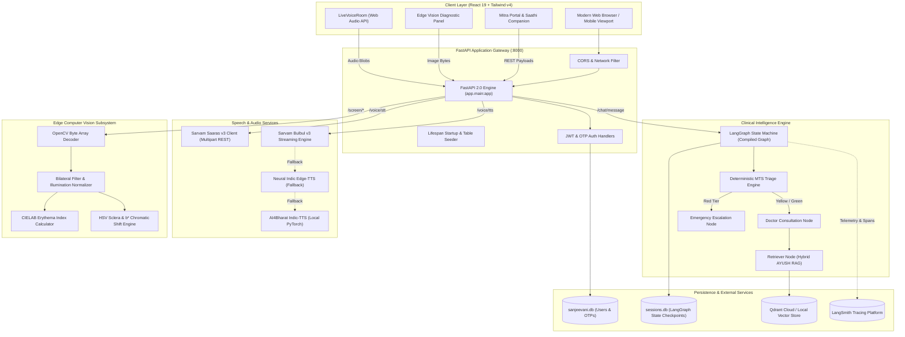
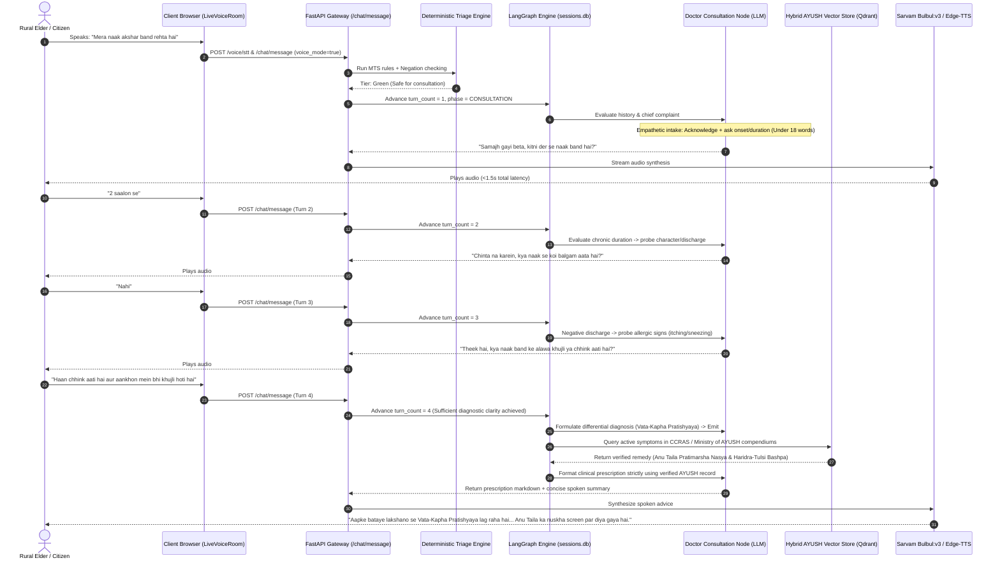
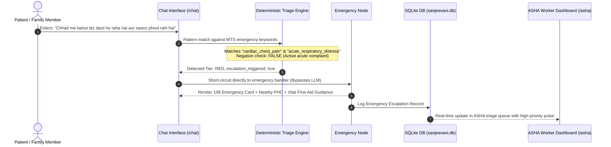
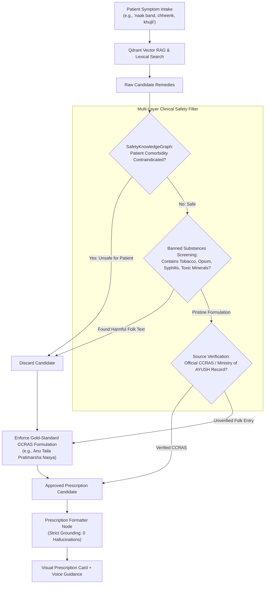
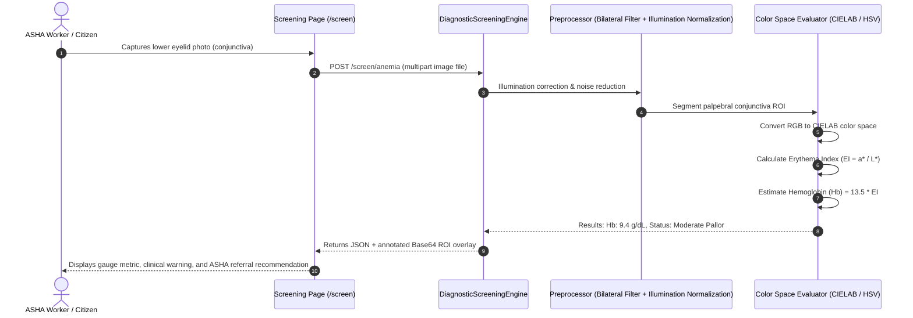

# 02. Architecture & System Workflow

## 1. High-Level Architectural Topology

Project Sanjeevani is constructed using a decoupled, asynchronous micro-modular architecture:



---

## 2. End-to-End Request Lifecycles

### A. Conversational Voice Consultation & Doctor Diagnostic Intake (Sanjeevani Live)



---

### B. Emergency Red-Tier Escalation Lifecycle



---

### C. Offline-First Resilience & Bi-Directional Synchronization

```mermaid
flowchart TD
    subgraph Client ["Client Device (Browser / Mobile)"]
        UI["User Chat Interface"]
        SW["Service Worker (PWA Cache)"]
        IDB[("Client IndexedDB\n(offline_consultations queue)")]
        NetWatch{"Network Status\n(navigator.onLine)"}
        OfflineEngine["Offline Diagnostic Fallback Engine\n(In-Browser Symptom Matcher)"]
    end

    subgraph Network ["Internet Connection"]
        SyncRequest["POST /chat/offline-sync\n(Batch Queue Transmission)"]
    end

    subgraph Server ["FastAPI Backend"]
        SyncEndpoint["Offline Sync Handler (/chat/offline-sync)"]
        Checkpointer["ResilientCheckpointer\n(Dual Engine)"]
        LocalSQLite[("sessions.db\n(WAL Mode SQLite)")]
        CloudCluster[("PostgreSQL / Qdrant Cloud")]
        Analytics["Analytics Logger"]
    end

    UI -->|Message Entered| NetWatch
    NetWatch -->|Offline: No Connection| OfflineEngine
    OfflineEngine -->|Instant Local Reply| UI
    OfflineEngine -->|Store Pending Session| IDB

    NetWatch -->|Online: Connection Restored| SyncRequest
    IDB -->|Drain Pending Consultations| SyncRequest
    SyncRequest --> SyncEndpoint

    SyncEndpoint --> Checkpointer
    Checkpointer -->|Immediate Local Write| LocalSQLite
    Checkpointer -->|Async Upstream Mirror| CloudCluster
    SyncEndpoint --> Analytics
    SyncEndpoint -->>|200 OK: Synced Count| IDB
    IDB -->|Mark Synced| UI
```

---

### D. AYUSH Clinical Safety & Substance Exclusion Filter



---

### E. Edge Computer Vision Screening Lifecycle



---

## 3. Data Storage & Persistence Strategy

| Data Asset | Storage Engine | Technology | Persistence Policy |
|---|---|---|---|
| **Users & Authentication** | Relational DB | SQLite3 (`sanjeevani.db`) with WAL mode | Permanent transactional storage |
| **One-Time Passwords (OTPs)**| Relational DB | SQLite3 (`sanjeevani.db`) table `otps` | Auto-invalidated upon verification or expiry |
| **LangGraph Checkpoints** | State DB | SQLite3 (`sessions.db`) via `ResilientCheckpointer` | Permanent zero-amnesia multi-turn conversation memory |
| **AYUSH Remedies Vectors** | Vector Store | Qdrant Cloud / Local on-disk (`qdrant_data`) | Pre-seeded with CCRAS dataset & docx treaties |
| **Garhwali Dialect Vectors** | Vector Store | Qdrant collection `sanjeevani_garhwali` | Pre-seeded with regional dialect phrases (1300+ points) |
| **Offline Sync Queue** | Client Store | Browser IndexedDB (`offline_consultations`) | Persisted on client until acknowledged by backend sync |
| **Execution Telemetry** | Cloud Observability | LangSmith Cloud SaaS | Distributed tracing for agent steps, tokens, and latency |

