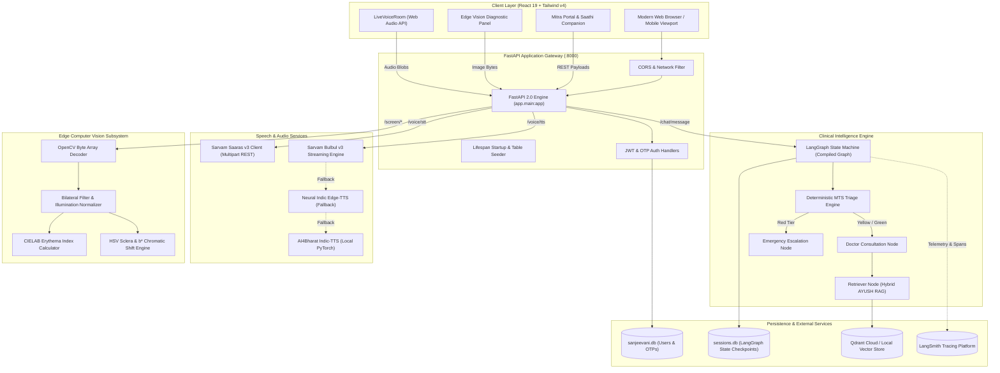
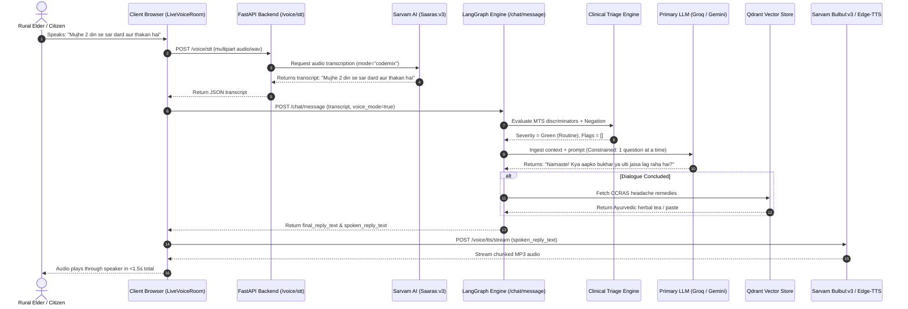
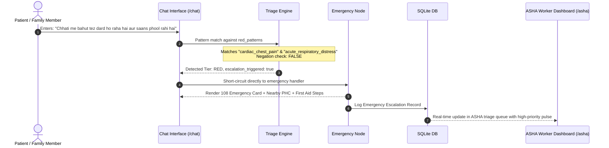
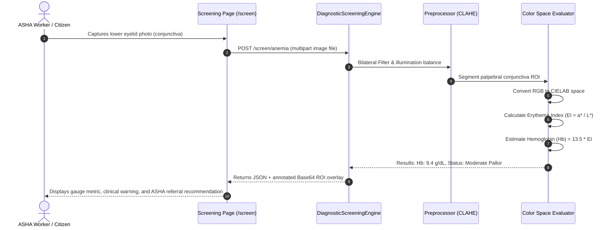

# 02. Architecture & System Workflow

## 1. High-Level Architectural Topology

Project Sanjeevani is constructed using a decoupled, asynchronous micro-modular architecture:

---

## 2. End-to-End Request Lifecycles

### A. Conversational Voice Consultation (Sanjeevani Live)

---

### B. Emergency Red-Tier Escalation Lifecycle

---

### C. Edge Vision Screening Lifecycle

---

## 3. Data Storage & Persistence Strategy

| Data Asset | Storage Engine | Technology | Persistence Policy |
|---|---|---|---|
| **Users & Authentication** | Relational DB | SQLite3 (`sanjeevani.db`) with WAL mode | Permanent transactional storage |
| **One-Time Passwords (OTPs)**| Relational DB | SQLite3 (`sanjeevani.db`) table `otps` | Auto-invalidated upon verification or expiry |
| **LangGraph Checkpoints** | State DB | SQLite3 (`sessions.db`) via `SqliteSaver` | Permanent multi-turn conversation memory |
| **AYUSH Remedies Vectors** | Vector Store | Qdrant Cloud / Local on-disk (`qdrant_data`) | Pre-seeded with CCRAS dataset & docx treaties |
| **Garhwali Dialect Vectors** | Vector Store | Qdrant collection `sanjeevani_garhwali` | Pre-seeded with regional dialect phrases |
| **Execution Telemetry** | Cloud Observability | LangSmith Cloud SaaS | 14-day retention for development traces |
