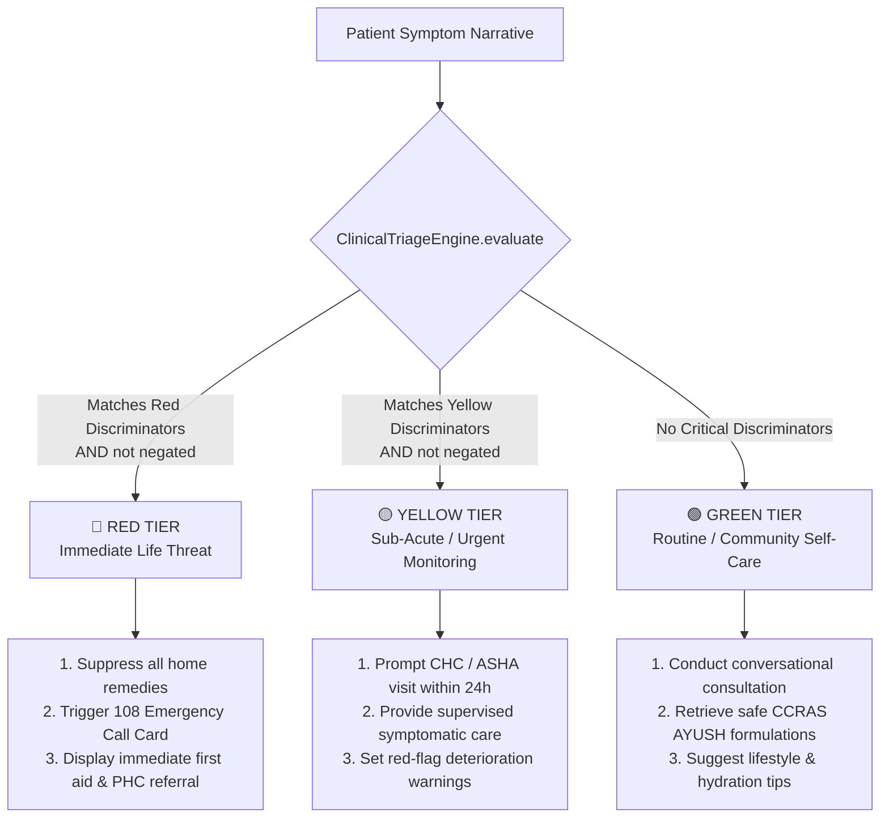

# 03. Clinical Triage & Safety Engine

## 1. Clinical Foundation: Manchester Triage System (MTS)

In high-stakes clinical triage, **generative AI must never be allowed to autonomously classify emergencies**. LLMs can suffer from subtle hallucinations, stochastic omissions, and tone dilution under pressure.

To provide an absolute safety guarantee, Sanjeevani implements a deterministic rules-based clinical triage engine in [`backend/app/core/triage_engine.py`](file:///d:/Sanjeevani/backend/app/core/triage_engine.py) modeled after the international **Manchester Triage System (MTS)**.

---

## 2. Severity Tiers & Clinical Actions



### Tier Definitions:

| Tier | Priority Level | Target Response Window | Clinical Scope & Triggers | Protocol Action |
|---|:---:|:---:|---|---|
| 🔴 **Red** | Priority 1 | Immediate ($<10$ mins) | Cardiac chest pain, radiating arm pain, acute dyspnea / gasping, severe hemoptysis, syncope / loss of consciousness, anaphylaxis, facial drooping (stroke), infant high fever ($>103^\circ\text{F}$). | Short-circuits directly to `emergency_node`. Disables remedy retrieval. Injects 108 emergency speed-dial and emergency first-aid protocols. |
| 🟡 **Yellow** | Priority 2 | Urgent ($<24$ hours) | Persistent fever ($>3$ days), severe localized abdominal pain, repeated/continuous vomiting, dehydration signs (anuria, sunken eyes), uncontrolled diarrhea. | Evaluates with doctor consultation. Issues cautionary alerts. Recommends evaluation by an ASHA worker or Medical Officer within 24 hours. |
| 🟢 **Green** | Priority 3 | Routine / Elective | Common cold, mild seasonal cough, superficial abrasions, routine digestive discomfort, mild headache, joint stiffness. | Full conversational exploration. Retrieves non-toxic CCRAS Ayurvedic remedies with dosage guidelines and dietary recommendations. |

---

## 3. Bi-Directional Negation Detection

In natural human speech, patients frequently express symptoms using negative qualifications:
- *"I have a cough but **no chest pain**"*
- *"khasi aur bukhar hai par **seene me dard nahi hai**"*
- *"mujhko chakkar **nahi aa rahe hain**"*

If a basic keyword or regex matcher evaluated *"chest pain"* or *"seene me dard"*, it would generate a false-positive emergency escalation.

To solve this, Sanjeevani's triage engine implements a **bi-directional 35-character sliding window**:

```python
self.negation_window = 35

self.negation_cues = {
    # English Prefix Cues
    "no", "not", "without", "denies", "free of", "never",
    # Hindi Postfix & Prefix Cues
    "nahi", "nahin", "koi nahi", "na", "bina", "mat"
}
```

### Algorithmic Execution:
```python
def _is_negated(self, text: str, match_start: int, match_end: int) -> bool:
    # 1. Check Preceding Text (Prefix negation: e.g. "no chest pain")
    pre_start = max(0, match_start - self.negation_window)
    preceding_text = text[pre_start:match_start].lower()
    pre_tokens = re.findall(r"\b\w+\b", preceding_text)
    if any(cue in pre_tokens for cue in self.negation_cues):
        return True

    # 2. Check Succeeding Text (Postfix negation: e.g. "seene me dard nahi hai")
    post_end = min(len(text), match_end + self.negation_window)
    succeeding_text = text[match_end:post_end].lower()
    post_tokens = re.findall(r"\b\w+\b", succeeding_text)
    if any(cue in post_tokens for cue in self.negation_cues):
        return True

    return False
```

---

## 4. Multi-Word Clinical Regex Discriminators

The engine defines comprehensive regex patterns covering English, formal Hindi, and colloquial Hinglish expressions:

```python
self.red_patterns = {
    "cardiac_chest_pain": [
        r"\bchest\s+(?:tightness|pressure|pain|discomfort)\b",
        r"\b(?:pressure|pain|tightness|heaviness)\s+(?:in\s+(?:the\s+|my\s+)?)?chest\b",
        r"\b(?:seene|chhati|dil)\s+(?:me\s+)?(?:\w+\s+){0,3}dard\b",
        r"\bleft\s+arm\s+pain\b",
        r"\bheart\s+pain\b"
    ],
    "acute_respiratory_distress": [
        r"\b(?:shortness\s+of\s+breath|difficulty\s+breathing|cannot\s+breathe|gasping)\b",
        r"\bsaans\s+(?:lene\s+me\s+)?(?:\w+\s+){0,2}(?:takleef|dikkat|phoolna)\b",
        r"\bdum\s+ghutna\b",
        r"\bghutan\s+ho\s+rahi\b"
    ],
    "altered_mental_status": [
        r"\b(?:unconscious|unresponsive|fainted|passed\s+out|seizure|convulsion)\b",
        r"\b(?:behosh|daura|chakkar\s+khakar\s+girna)\b"
    ],
    "severe_hemorrhage": [
        r"\b(?:heavy\s+bleeding|coughing\s+blood|vomiting\s+blood|bleeding\s+profusely)\b",
        r"\bkhoon\s+ki\s+(?:ulti|khasi)\b",
        r"\bzyada\s+khoon\s+behna\b"
    ],
    "infant_high_fever": [
        r"\b(?:infant|baby|newborn)\s+high\s+fever\b",
        r"\b(?:navjaat|chote\s+bachhe)\s+(?:ko\s+)?(?:\w+\s+){0,2}tezz\s+bukhar\b"
    ],
    "anaphylaxis_stroke": [
        r"\b(?:face\s+drooping|slurred\s+speech|throat\s+closing|lips\s+blue)\b",
        r"\b(?:chehra\s+tedha|gala\s+band\s+hona|muh\s+tedha)\b"
    ]
}
```

---

## 5. Emergency Protocol Enforcement

When `SeverityTier.RED` is returned:
1. `AgentState["escalation_triggered"]` is set to `True`.
2. The state router immediately halts the consultation dialogue.
3. The response payload returns an emergency alert payload containing:
   - **Toll-Free Ambulatory Emergency**: **108 (National Ambulance Service)**.
   - **Health Tele-Consultation**: **104 (Uttarakhand Health Helpline)**.
   - **Nearest Primary Health Centers** based on regional geo-coordinates (e.g., District Hospital Gopeshwar, CHC Karnaprayag).
   - **Essential First Aid Stabilization Rules** (e.g., *Keep patient lying on their left side if semi-conscious*, *Do not administer oral fluids*).
