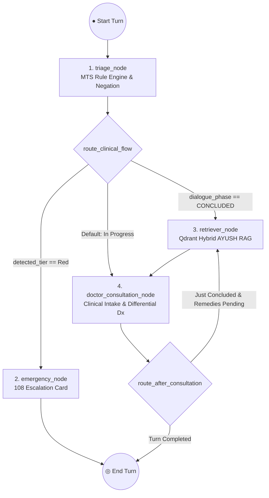
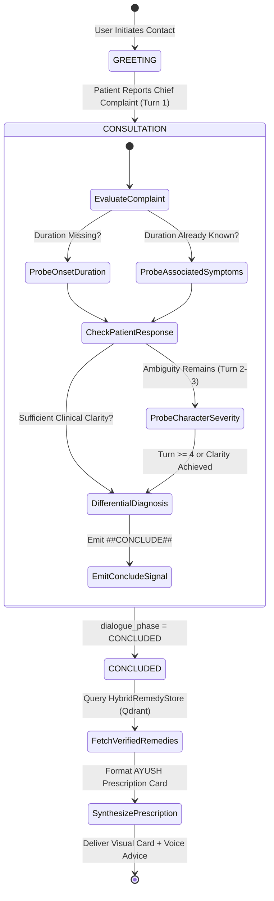

# 04. LangGraph Agent & Dialogue Flow

## 1. Why LangGraph for Clinical Consultation?

Traditional chatbots built on flat prompt chains or simple router agents lack deterministic phase control and state memory. When managing clinical interactions, the system must:
- Persist patient symptoms across multiple turns without re-asking questions already answered.
- Enforce strict state transitions (e.g., you cannot jump to prescribing remedies before taking the patient's history).
- Support pause/resume capabilities across different devices and sessions.

Sanjeevani implements **LangGraph** (`app/agents/graph.py`), a cyclic state machine with persistent SQLite state checkpoints (`sessions.db` via `SqliteSaver`).

---

## 2. The `AgentState` Specification

Located in [`backend/app/agents/state.py`](file:///d:/Sanjeevani/backend/app/agents/state.py), the `AgentState` TypedDict holds all conversational and clinical variables:

```python
class SymptomProfile(TypedDict, total=False):
    chief_complaint: str
    duration: str
    severity: str
    associated_symptoms: List[str]

class _AgentStateRequired(TypedDict):
    conversation_id: str
    raw_user_message: str
    detected_tier: str              # "Green" | "Yellow" | "Red"
    clinical_flags: List[str]       # Matched MTS flags
    retrieved_remedies: List[Dict]  # Qdrant payloads
    final_reply_text: str          # Formatted Markdown for chat UI
    spoken_reply_text: str         # Stripped text for TTS engine
    escalation_triggered: bool     # True if Red tier tripped

class AgentState(_AgentStateRequired, total=False):
    normalized_message: str        # Garhwali-normalized text
    detected_language: str         # "hi" | "en" | "garhwali"
    patient_conditions: List[str]  # Known chronic conditions (e.g. Diabetes)
    dialogue_phase: str            # "GREETING" | "CONSULTATION" | "CONCLUDED" | "EMERGENCY"
    prev_dialogue_phase: str       # Snapshot before turn transition
    turn_count: int                # Counter of exchanges in this session
    symptom_profile: SymptomProfile # Extracted clinical profile
    consultation_notes: str        # Running summary of patient complaints
    voice_mode: bool               # True if speaking via Sanjeevani Live
```

---

## 3. The LangGraph Execution Graph & Cyclic Routing



### The 4 Execution Nodes:

#### 1. `triage_node` (`app/agents/nodes/triage_node.py`)
- Normalizes Garhwali dialect terms using the regional glossary.
- Runs the deterministic `ClinicalTriageEngine.evaluate()` on the user's message.
- Sets `detected_tier` (`"Red"`, `"Yellow"`, `"Green"`) and populates `clinical_flags`.
- Advances `turn_count` and maintains `dialogue_phase`.

#### 2. `emergency_node` (`app/agents/nodes/emergency_node.py`)
- Executed exclusively when `detected_tier == "Red"`.
- Bypasses all LLM calls to prevent latency or inappropriate text generation.
- Generates an immediate emergency response with 108 ambulance contact, nearest PHC locations, and vital first-aid instructions.

#### 3. `retriever_node` (`app/agents/nodes/retriever_node.py`)
- Executed when `dialogue_phase == "CONCLUDED"`.
- Uses `extract_active_symptoms()` to generate a clean symptom query (filtering out doctor questions and negative patient responses like *"nahi/no"*).
- Uses the `HybridRemedyStore` to query **Qdrant Vector Database** over 178 indexed CCRAS formulations.
- Validates each candidate against `SafetyKnowledgeGraph` (comorbidities/pregnancy) and filters out any hazardous folk entries.
- Injects validated formulations into `state["retrieved_remedies"]`.

#### 4. `doctor_consultation_node` (`app/agents/nodes/responder_node.py`)
- The clinical conversational brain operating as **Dr. Sanjeevani** — an experienced, empathetic rural physician.
- **Adaptive Intake (Up to 5 Turns)**: Replaces rigid canned scripts with real clinical history taking:
  - **Turn 1 (Chief Complaint & Duration)**: Identifies the primary symptom and inquires about onset/duration if missing.
  - **Turn 2 (Associated Symptoms & Character)**: Probes key accompanying symptoms (e.g. wet vs. dry cough, burning/acidity, radiation of pain, digestive signs).
  - **Turn 3 (Differential Exploration)**: Explores aggravating/relieving factors, severity, and subtle symptoms needed for Ayurvedic dosha determination.
  - **Turn 4-5 (Conclusion & Prescription)**: Once differential diagnosis is clear, emits `##CONCLUDE##` and formats the prescription strictly using the verified AYUSH compendium.
- **Voice-First Constraint**: Under 18 words per inquiry, strictly **one question at a time**, preceded by gentle reassuring empathy (`"Samajh gayi beta"`, `"Chinta na karein"`).
- **Strict AYUSH Dataset Compliance**: Mandates 100% adherence to the retrieved CCRAS / AYUSH dataset formulation with zero modern pharmaceutical hallucination.

---

## 4. Multi-Turn Clinical Intake State Machine



---

## 5. State Checkpointing & Persistence (`ResilientCheckpointer`)

LangGraph uses `SqliteSaver` connected to `sessions.db`:
```python
conn = sqlite3.connect("sessions.db", check_same_thread=False)
checkpointer = SqliteSaver(conn)
sanjeevani_workflow = builder.compile(checkpointer=checkpointer)
```

### What this enables:
1. **Thread Isolation**: Each user or session has a unique `thread_id = conversation_id`.
2. **Crash Resilience**: If the server restarts during a consultation, the patient's state, previous answers, and identified symptoms are seamlessly restored from SQLite.
3. **Session Drawer**: Users can switch between past consultation sessions or review their history via the `/chat/history/{conversation_id}` endpoint.

---

## 5. Multi-Tier LLM Failover Architecture

Located in [`backend/app/agents/nodes/responder_node.py`](file:///d:/Sanjeevani/backend/app/agents/nodes/responder_node.py):

```
┌────────────────────────────────────────────────────────────────────────┐
│                        LLM AUTO-FAILOVER CASCADE                       │
├────────────────────────────────────────────────────────────────────────┤
│  Tier 1 (Primary)   │  Groq ChatGroq (Llama-3.1-8b-instant)            │
│                     │  Ultra-low latency (<400ms TTFT)                 │
├─────────────────────┼──────────────────────────────────────────────────┤
│  Tier 2 (Secondary) │  Google Gemini 1.5 Flash                         │
│                     │  High-context multilingual fallback              │
├─────────────────────┼──────────────────────────────────────────────────┤
│  Tier 3 (Tertiary)  │  Sarvam Indic LLM (sarvam-105b)                  │
│                     │  Deep native Indic & Hindi syntax reasoning      │
├─────────────────────┼──────────────────────────────────────────────────┤
│  Tier 4 (Offline)   │  Deterministic Rule Templates                    │
│                     │  Guaranteed safety response if internet fails    │
└─────────────────────┴──────────────────────────────────────────────────┘
```

If Groq experiences rate limits or timeouts, the node automatically catches the exception, logs it, and falls back to Gemini or Sarvam without returning a 500 error to the user.
