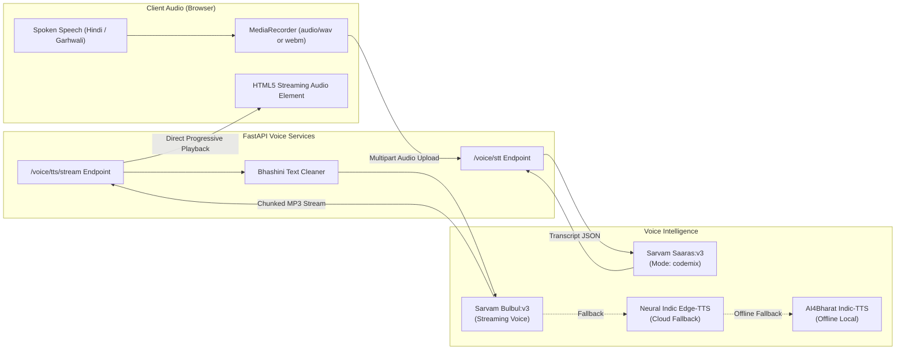

# 05. Multilingual Voice & Speech Subsystem

## 1. The Need for Low-Latency Voice (Sanjeevani Live)

In mountainous regions, typing on small smartphone keyboards is a significant friction point for rural citizens, especially:
- Elderly patients with vision impairments or tremor.
- Citizens speaking regional dialects who may not know standard Devanagari or English spelling.
- Emergency situations where fast hands-free communication is necessary.

Sanjeevani solves this with **Sanjeevani Live**, an integrated voice-in, voice-out conversational interface powered by **Sarvam AI**.

---

## 2. Speech Architecture & Pipeline



---

## 3. Speech-to-Text (STT): Sarvam AI Saaras v3

Implemented in [`backend/app/core/sarvam_stt.py`](file:///d:/Sanjeevani/backend/app/core/sarvam_stt.py).

### Why Saaras v3?
General ASR models trained predominantly on Western English or formal broadcast Hindi fail when confronted with:
- Colloquial Hinglish code-mixing (*"Doctor saab, mujhe thoda chest me discomfort ho raha hai"*).
- Garhwali grammatical inflections and regional loanwords.
- Low-cost mobile phone microphones with background wind and room reverberation.

### Client Implementation:
```python
async def transcribe_audio(
    self,
    audio_bytes: bytes,
    content_type: str = "audio/wav",
    model: str = "saaras:v3",
    mode: str = "codemix"
) -> Dict[str, Any]:
    url = f"{self.base_url}/speech-to-text"
    headers = {"api-subscription-key": self.api_key}
    
    files = {"file": ("audio_input.wav", audio_bytes, content_type)}
    data = {"model": model, "mode": mode}

    async with httpx.AsyncClient(timeout=15.0) as client:
        resp = await client.post(url, headers=headers, data=data, files=files)
        return resp.json()
```
The endpoint returns:
- `transcript`: Clean textual representation in standard Devanagari script.
- `language_code`: Detected language (e.g., `hi-IN`).
- `language_probability`: Confidence score.

---

## 4. Text-to-Speech (TTS): Streaming Sarvam Bulbul v3

Implemented in [`backend/app/core/tts_engine.py`](file:///d:/Sanjeevani/backend/app/core/tts_engine.py).

### Progressive Streaming:
Instead of waiting for an entire paragraph to synthesize into a complete WAV/MP3 file before sending it to the client, the `/voice/tts/stream` endpoint streams audio chunks via chunked transfer encoding (`Transfer-Encoding: chunked`).

The client begins playback within **300ms–500ms** of the LLM completing its first sentence, achieving an end-to-end turn time under **1.5 seconds**.

### Multi-Provider Fallback Hierarchy:
1. **Primary**: `Sarvam AI (bulbul:v3)` — High naturalness, warm Indian voice inflections, accurate pronunciation of Ayurvedic botanical names (*Tulsi*, *Ashwagandha*, *Giloy*).
2. **Secondary Fallback**: `Edge-TTS` (`hi-IN-SwaraNeural` / `hi-IN-MadhurNeural`) — Highly reliable cloud neural voice with zero configuration.
3. **Tertiary Offline Fallback**: `AI4Bharat Indic-TTS` (`ai4bharat_tts.py`) — Local PyTorch acoustic and vocoder model (`FastSpeech2 + HiFi-GAN`) running on edge CPU for zero-connectivity health outposts.

---

## 5. Conversational Voice Guardrails

When communicating via speech, text designed for visual reading becomes awkward or confusing:
- Patients cannot remember a barrage of 4-5 questions spoken sequentially.
- Technical markdown symbols (e.g., `**bold**`, `## Heading`, `* item`) sound jarring when read aloud by screen readers or TTS engines.

Sanjeevani enforces two conversational voice guardrails:

### Guardrail 1: Single-Question Conversational Pacing
When `voice_mode == True`, the LLM system prompt strictly instructs:
> *"Aap Sanjeevani Live voice mode me hain. Kripya apna uttar chhota (zyada se zyada 2-3 panktiyon me) rakhein. Ek baar me KEVL EK hi prashn poochhein taaki mariz aasaani se sun aur samajh sake."*

### Guardrail 2: Automatic Markdown & Technical Symbol Stripping
The `BhashiniVoiceEngine.format_tts_payload` cleans all text before TTS:
- Strips Markdown headers (`#`, `##`, `###`).
- Strips bold/italic markers (`**`, `*`, `_`).
- Converts numbered lists (`1. `, `2. `) into natural spoken pauses.
- Removes URLs, brackets, and code tags.
