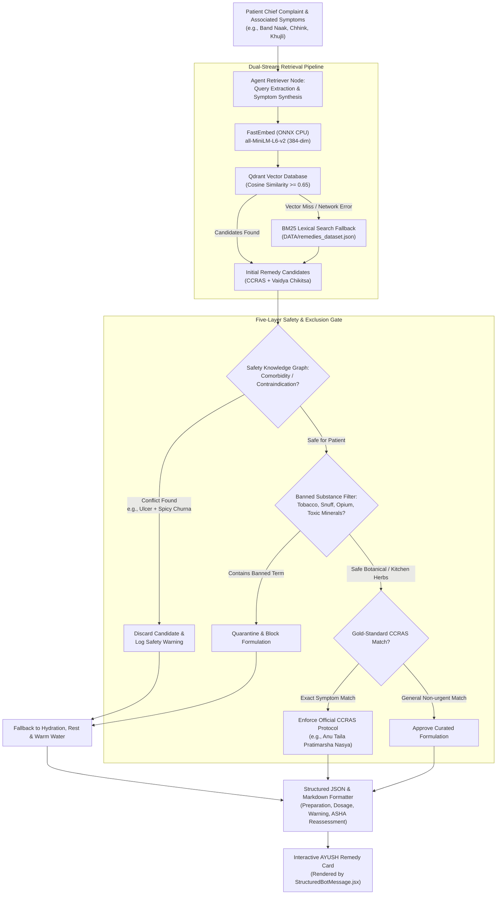

# 06. AYUSH Hybrid RAG & Knowledge Store

## 1. Grounding Clinical Guidance in Traditional AYUSH Wisdom

In rural Uttarakhand, home remedies (*Gharelu Upchar*) and Ayurvedic herbs form the first line of defense for non-urgent ailments. However, misinformation and inaccurate herbal dosages can lead to adverse toxicity or delay needed medical care.

Sanjeevani implements a **Hybrid Retrieval-Augmented Generation (RAG)** store in [`backend/app/core/hybrid_rag.py`](file:///d:/Sanjeevani/backend/app/core/hybrid_rag.py) to ground non-urgent self-care recommendations in validated Ayurvedic clinical sources.

---

## 2. The Dual-Source Knowledge Corpus

```
┌────────────────────────────────────────────────────────────────────────┐
│                   SANJEEVANI AYUSH KNOWLEDGE CORPUS                    │
├────────────────────────────────────────────────────────────────────────┤
│  Source 1: CCRAS Standardized Formulations                             │
│  - Dataset: DATA/remedies_dataset.json                                 │
│  - Formulations: 100+ validated recipes for fever, cold, cough,        │
│    digestive ailments, joint pain, skin irritations.                   │
│  - Attributes: Indications, Preparation, Dosage, Contraindications.    │
├────────────────────────────────────────────────────────────────────────┤
│  Source 2: Classical Ayurveda Treatises                                │
│  - Document: DATA/Ayush/ayurveda_1.docx                                │
│  - Extractor: app/core/ayush_docx_extractor.py                         │
│  - Formulations: Classical polyherbal preparations (Kashayam, Churna,  │
│    Vati, Asava) extracted into structured JSON.                        │
├────────────────────────────────────────────────────────────────────────┤
│  Source 3: Vaidya Chikitsa Clinical Ailments (114 Chapters)            │
│  - Document: DATA/Ayush/vaidya_chikitsha.docx                          │
│  - Curator: app/core/ayush_knowledge_curator.py                        │
│  - Dataset: DATA/vaidya_chikitsa_curated.json (72 Household-Safe,      │
│    19 Require Consultation, 23 Clinical Emergencies segregated).       │
│  - Attributes: Causes, Symptoms, General Treatment, Diet (Pathya).     │
├────────────────────────────────────────────────────────────────────────┤
│  Source 4: Dravyaguna Botanical Herbs (119 Medicinal Plants)           │
│  - Document: DATA/Ayush/BotanicalHerb.docx                             │
│  - Dataset: DATA/botanical_herbs_curated.json                          │
│  - Attributes: Vernacular names, Hot/Cold thermal energy, Dosha balance│
│    (Vata, Pitta, Kapha), and therapeutic organ benefits.               │
├────────────────────────────────────────────────────────────────────────┤
│  Source 5: Garhwali Regional Dialect Lexicon                           │
│  - Directory: DATA/Garhwali/                                           │
│  - Content: Mapping of mountain colloquial health complaints to       │
│    clinical terms (e.g. mund dard ➔ headache, pet chhutna ➔ diarrhea).│
└────────────────────────────────────────────────────────────────────────┘
```

---

## 3. FastEmbed Dense Vector Embeddings

To ensure rapid initialization and avoid multi-gigabyte memory footprints, Sanjeevani utilizes **FastEmbed**:

- **Model**: `sentence-transformers/all-MiniLM-L6-v2`
- **Embedding Dimensionality**: 384 dimensions
- **Inference Runtime**: ONNX Runtime optimized for CPU
- **Local Model Caching**:
  ```python
  cache_dir = os.path.join(os.getcwd(), "models_cache")
  self.embedding_model = TextEmbedding(
      model_name="sentence-transformers/all-MiniLM-L6-v2",
      cache_dir=cache_dir
  )
  ```
  This eliminates internet dependency on subsequent server boots and prevents Windows temporary directory lockups.

---

## 4. Qdrant Vector Storage Architecture

Sanjeevani dynamically bridges between **Qdrant Cloud** and **Local On-Disk Storage**:

```python
# Automatic Failover Logic in HybridRemedyStore:
if qdrant_url and qdrant_api_key:
    try:
        self.client = QdrantClient(url=qdrant_url, api_key=qdrant_api_key, timeout=10.0)
        self.is_cloud = True
    except Exception:
        # Seamlessly fallback to local filesystem storage
        self.client = QdrantClient(path=settings.QDRANT_PATH)
        self.is_cloud = False
else:
    self.client = QdrantClient(path=settings.QDRANT_PATH)
    self.is_cloud = False
```

### Vector Collections:
1. **`sanjeevani_remedies`**: Contains 147 validated, curated CCRAS and classical Ayurvedic formulations with dense 384-dimensional vector embeddings and rich metadata payloads:
   - `remedy_name`: e.g., *"Anu Taila Pratimarsha Nasya & Haridra-Tulsi Bashpa"*, *"Adrak-Tulsi Kadha"*
   - `category`: e.g., *"Allergic Rhinitis / Pratishyaya"*, *"Respiratory & Cold"*, *"Digestive Disorders"*
   - `ingredients`: Precise classical botanical and kitchen items (e.g., *Vitex negundo*, *Anu Taila*, *Haridra*, *Tulsi*)
   - `preparation`: Step-by-step preparation, filtration, and application methods
   - `dosage`: Safe clinical frequency (e.g., *"2 drops in each nostril morning/evening"*)
   - `safety_precaution`: Critical warnings, contraindications, and 108/PHC referral advisories
2. **`sanjeevani_garhwali`**: Contains dialect-to-Hindi mapping vectors used by `triage_node` to normalize regional complaints.

---

## 5. Clinical Diagnosis & Retrieval Workflow

When the consultation state machine reaches the `CONCLUDED` phase:

### 1. Weighted Clinical Symptom Classification:
[`backend/app/agents/nodes/responder_node.py`](file:///d:/Sanjeevani/backend/app/agents/nodes/responder_node.py) runs weighted phrase matching against `CLINICAL_SYMPTOM_REGISTRY` to determine the precise diagnosis rather than defaulting to generic fatigue:
- **`allergic_rhinitis`** (weight 1.5–2.0): Congestion (`naak band`, `band naak`), sneezing (`chheenk`, `chhink`), itchy/watery eyes (`aankhon me khujli`), sinus, Pratishyaya.
- **`joint_pain`**: Arthritis, stiffness, sandhivata, gathiya (`jod dard`, `ghutna dard`).
- **`acidity`**: Hyperacidity, acid reflux, heartburn, amlapitta (`seene mein jalan`, `khatti dakar`).
- **`skin_allergy`**: Rashes, urticaria, itching, sheeta pitta, charmarog (`tvacha khujli`, `daane`).
- **`headache` / `fever` / `cough` / `stomach`**: Core primary care categories.

### 2. Multi-Turn Patient History Synthesis:
Rather than extracting conversational filler from the user's last turn (e.g., *"haan hoti hai, aur saath main..."*), `_format_concluded_remedy()` synthesizes the patient's entire chief complaint trajectory across turns:
> *"mera naak akshar band rehta hai (lagbhag 3 saalon se naak band rehta hai, aankhon main khujli aur paani kaa aana bhi.)"*

### 3. Dual-Stream Retrieval & Strict Gating:
1. FastEmbed computes dense embeddings anchored with canonical clinical terms.
2. Qdrant executes Cosine Similarity search with banned historical substance filtering (blocking tobacco, snuff, toxic mercury).
3. **Strict Candidate Gating**: Secondary alternative remedies are only included if their similarity score satisfies:
   $$\text{Score}_{\text{secondary}} \ge 0.40 \quad \text{and} \quad \text{Score}_{\text{secondary}} \ge 0.70 \times \text{Score}_{\text{primary}}$$
   This strictly prevents irrelevant or orphaned recommendations (e.g., Ashwagandha Ksheerapaka during rhinitis consultations).

### 4. Interactive Frontend Card Rendering:
The frontend renders concluded guidance using structured components:
- **`Mukhya Nuskha` (Primary Remedy)**: Full preparation steps, ingredients, and dosage.
- **`Vaikalpik Nuskha` (Alternative Option)**: Optional secondary choice if gated and verified.
- **Consolidated Disclaimer**: Replaced duplicate per-card warnings with a single, centered advisory banner (`Yeh AI ka anumaan hai, doctor ka nidaan nahi`) positioned directly above the clinical record export buttons.

## 6. End-to-End AYUSH RAG & Knowledge Graph Safety Pipeline

The following flowchart demonstrates how patient symptoms are safely matched against official government AYUSH guidelines while preventing contraindications, toxic folk remedies, or substance misuse:


