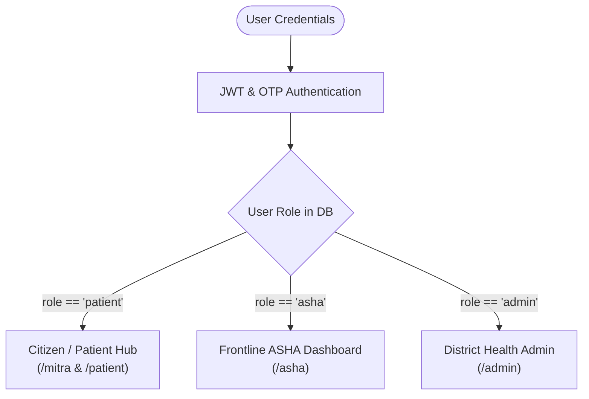

# 09. User Roles & Portals

## 1. Role-Based Access Architecture (RBAC)

Sanjeevani implements strict Role-Based Access Control enforcing three distinct clinical and administrative personas:



---

## 2. Portal Breakdown & Feature Comparison

| Feature Capability | Citizen (`patient`) | ASHA Worker (`asha`) | District Admin (`admin`) |
|---|:---:|:---:|:---:|
| **Dr. Sanjeevani AI Triage Chat** | ✅ | ✅ | ✅ |
| **Sanjeevani Live (Voice Consultation)** | ✅ | ✅ | ✅ |
| **Edge Vision Diagnostics (Eye & Skin)** | ✅ | ✅ | ✅ |
| **Sanjeevani Saathi (Elder Companion)** | ✅ | ❌ | ❌ |
| **Yogashala & Dhyan Guru** | ✅ | ❌ | ❌ |
| **Community Triage Distribution Queue** | ❌ | ✅ | ✅ |
| **Red-Tier Patient Escalation Alerts** | ❌ | ✅ | ✅ |
| **Hospital Referral Slip Generator** | Self Copy | Full Community Slips | Full Audit Slips |
| **System Telemetry & Latency Metrics** | ❌ | ❌ | ✅ |
| **Primary LLM Provider Toggle** | ❌ | ❌ | ✅ |
| **User Role & Database Management** | ❌ | ❌ | ✅ |

---

## 3. Citizen / Patient Hub (`/mitra` & `/patient`)

The central dashboard for rural families and individuals:
- **One-Tap Consultation Launcher**: Instant switch between text chat and hands-free voice room.
- **Recent Health Insights**: Shows active triage phase, detected symptoms, and past sessions.
- **Visual Vision Screening Hub**: Direct camera upload cards for eye and skin evaluations.
- **Himalayan Wellness Section**: Quick access to Yoga, Meditation, and Village Companion.
- **Nearby Medical Facility Finder**: Displays closest Primary Health Centers (PHCs) with telephone numbers and driving distance.

---

## 4. Frontline ASHA Worker Dashboard (`/asha`)

Engineered specifically for Accredited Social Health Activists managing multiple village hamlets:

```
┌────────────────────────────────────────────────────────────────────────┐
│                      ASHA WORKER TRIAGE DASHBOARD                      │
├────────────────────────────────────────────────────────────────────────┤
│  🔴 Emergency Escalations (Immediate Action Required)                  │
│  - Patient: Ramesh Chandra (Gopeshwar Ward 2)                          │
│    Issue: Chest tightness + Dyspnea ➔ 108 Ambulance Alerted            │
├────────────────────────────────────────────────────────────────────────┤
│  🟡 Priority Follow-up Queue (Within 24 Hours)                         │
│  - Patient: Kamla Devi (Mandal Village)                                │
│    Issue: High fever 4 days ➔ Suspected viral / malaria                │
├────────────────────────────────────────────────────────────────────────┤
│  🟢 Community Self-Care Logs                                           │
│  - 28 cases monitored across beat (CCRAS herbal guidance delivered)    │
├────────────────────────────────────────────────────────────────────────┤
│  📄 Download Clinical Referral Slip (PDF format for District Hospital) │
└────────────────────────────────────────────────────────────────────────┘
```

### Digital Referral Slips:
ASHA workers can generate formatted, printable PDF referral slips (`/reports/referral-slip`) containing:
- Patient demographics and village identifier.
- Timestamped triage severity tier (Red / Yellow / Green).
- Extracted chief complaints, symptom duration, and clinical flags.
- Suggested provisional investigation (e.g., *CBC for anemia*, *Serum Bilirubin test*).

---

## 5. District Health Administrator Portal (`/admin`)

Designed for Chief Medical Officers (CMOs) and technical administrators:
- **Real-Time System Health**: Monitors backend Uvicorn status, SQLite database connectivity, and Qdrant vector store health.
- **Telemetry & Latency Monitoring**: View average LLM inference latency, STT recognition speeds, and TTS streaming throughput.
- **Dynamic LLM Switcher**: Toggle the primary LLM provider between **Groq (Llama-3.1)**, **Google Gemini 1.5 Flash**, and **Sarvam Indic LLM** on the fly without restarting the server.
- **User Management**: View registered community health workers, change user roles, and inspect recent authentication logs.

---

## 6. Authentication Architecture & OTP Verification

Implemented in [`backend/app/api/auth_api.py`](file:///d:/Sanjeevani/backend/app/api/auth_api.py):
- **Flexible Identification**: Users can log in using their **mobile phone number**, **email address**, or **username**.
- **Password Security**: Passwords hashed using standard `bcrypt` algorithms.
- **Real-World OTP Dispatch**:
  - **Email**: Dispatched via **Gmail SMTP** (`trustsnare@gmail.com`).
  - **SMS**: Dispatched via Indian mobile SMS gateways (**Fast2SMS** or **Twilio**).
- **Session Tokens**: Issues standards-compliant **JSON Web Tokens (JWT)** with configurable expiration stored in browser `localStorage`.
