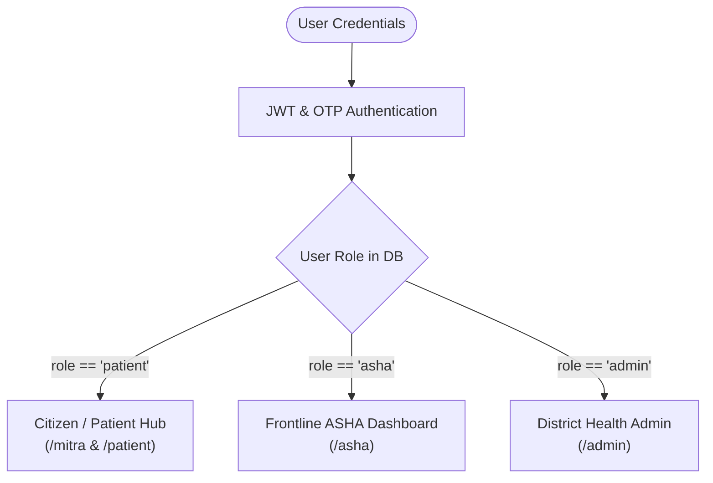

# 09. User Roles & Portals

## 1. Role-Based Access Architecture (RBAC)

Sanjeevani implements strict Role-Based Access Control enforcing three distinct clinical and administrative personas:


```mermaid
graph TD
    User([User Credentials]) --> Auth[JWT & OTP Authentication]
    Auth --> RoleCheck{User Role in DB}

    RoleCheck -->|role == 'patient'| PatientPortal["Citizen / Patient Hub\n(/mitra & /patient)"]
    RoleCheck -->|role == 'asha'| AshaPortal["Frontline ASHA Dashboard\n(/asha)"]
    RoleCheck -->|role == 'admin'| AdminPortal["District Health Admin\n(/admin)"]
```

---

## 2. Portal Breakdown & Feature Comparison

| Feature Capability | Citizen (`patient`) | ASHA Worker (`asha`) | District Admin (`admin`) |
|---|:---:|:---:|:---:|
| **Dr. Sanjeevani AI Triage Chat** | ✅ | ✅ | ✅ |
| **Sanjeevani Live (Voice Consultation)** | ✅ | ✅ | ✅ |
| **Edge Vision Diagnostics (Eye & Skin)** | ✅ | ✅ | ✅ |
| **Sanjeevani Saathi (Elder Companion)** | ✅ | ❌ | ❌ |
| **Yogashala & Dhyan Guru** | ✅ | ❌ | ❌ |
| **Community Triage Distribution Queue** | ❌ | ✅ | ✅ |
| **Red-Tier Patient Escalation Alerts** | ❌ | ✅ | ✅ |
| **Hospital Referral Slip Generator** | Self Copy | Full Community Slips | Full Audit Slips |
| **System Telemetry & Latency Metrics** | ❌ | ❌ | ✅ |
| **Primary LLM Provider Toggle** | ❌ | ❌ | ✅ |
| **User Role & Database Management** | ❌ | ❌ | ✅ |

---

## 3. Citizen / Patient Hub (`/mitra` & `/patient`)

The central dashboard for rural families and individuals:
- **One-Tap Consultation Launcher**: Instant switch between text chat and hands-free voice room.
- **Recent Health Insights**: Shows active triage phase, detected symptoms, and past sessions.
- **Visual Vision Screening Hub**: Direct camera upload cards for eye and skin evaluations.
- **Himalayan Wellness Section**: Quick access to Yoga, Meditation, and Village Companion.
- **Nearby Medical Facility Finder**: Displays closest Primary Health Centers (PHCs) with telephone numbers and driving distance.

---

## 4. Frontline ASHA Worker Dashboard (`/asha`)

Engineered specifically for Accredited Social Health Activists managing multiple village hamlets:

```
┌────────────────────────────────────────────────────────────────────────┐
│                      ASHA WORKER TRIAGE DASHBOARD                      │
├────────────────────────────────────────────────────────────────────────┤
│  🔴 Emergency Escalations (Immediate Action Required)                  │
│  - Patient: Ramesh Chandra (Gopeshwar Ward 2)                          │
│    Issue: Chest tightness + Dyspnea ➔ 108 Ambulance Alerted            │
├────────────────────────────────────────────────────────────────────────┤
│  🟡 Priority Follow-up Queue (Within 24 Hours)                         │
│  - Patient: Kamla Devi (Mandal Village)                                │
│    Issue: High fever 4 days ➔ Suspected viral / malaria                │
├────────────────────────────────────────────────────────────────────────┤
│  🟢 Community Self-Care Logs                                           │
│  - 28 cases monitored across beat (CCRAS herbal guidance delivered)    │
├────────────────────────────────────────────────────────────────────────┤
│  📄 Download Clinical Referral Slip (PDF format for District Hospital) │
└────────────────────────────────────────────────────────────────────────┘
```

### Digital Referral Slips:
ASHA workers can generate formatted, printable PDF referral slips (`/reports/referral-slip`) containing:
- Patient demographics and village identifier.
- Timestamped triage severity tier (Red / Yellow / Green).
- Extracted chief complaints, symptom duration, and clinical flags.
- Suggested provisional investigation (e.g., *CBC for anemia*, *Serum Bilirubin test*).

---

## 5. District Health Administrator Portal (`/admin`)

Designed for Chief Medical Officers (CMOs), district epidemiologists, and technical administrators. The portal features an ergonomic **Vertical Sidebar Command Center** layout that organizes district operations into three dedicated operational sections:

```
┌─────────────────────────┬────────────────────────────────────────────────────────────────────────┐
│ SANJEEVANI COMMAND HQ   │  प्रशासन केंद्र > District Disease Surveillance & Heatmap                │
│ 🟢 12 Sectors Monitored │  [🚨 8 Red Alerts]  [📥 Export CSV]  [🔄 Refresh Sync]                 │
├─────────────────────────┼────────────────────────────────────────────────────────────────────────┤
│ SURVEILLANCE & GIS      │                                                                        │
│ 🔥 Disease Heatmap      │  [Interactive Himalayan Topographical Heatmap & Outbreak EWS]          │
│ 📢 CMO Broadcasts       │                                                                        │
├─────────────────────────┤                                                                        │
│ AI & CORE ENGINE        │                                                                        │
│ ⚙️ System & AI Controls │                                                                        │
├─────────────────────────┤                                                                        │
│ GOVERNANCE & ACCESS     │                                                                        │
│ 👥 User Directory       │                                                                        │
│ 📊 Telemetry & Audit    │                                                                        │
├─────────────────────────┤                                                                        │
│ 👤 Admin (District HQ)  │                                                                        │
│ [Exit to Mitra] [Sync]  │                                                                        │
└─────────────────────────┴────────────────────────────────────────────────────────────────────────┘
```

- **Vertical Navigation Sidebar**: Fixed desktop sidebar with functional categorizations, active state glows, and real-time alert badges.
- **Responsive Mobile Drawer**: Auto-collapsing slide-in drawer on small screens with hamburger trigger.
- **Deep-Linking & URL Sync**: Synchronized query parameters (`/admin?tab=surveillance`, `?tab=system-config`, `?tab=broadcast`, `?tab=users`, `?tab=audit`) enabling instant bookmarking, direct sharing, and browser back/forward support.
- **Persistent Top Action Bar**: Sticky breadcrumb trail, real-time unacknowledged Red-tier clinical distress counter button, and instant data export.

### A. Zero-Downtime System & AI Engine Controls
Empowers administrators to configure and adapt the platform in real-time directly from the Admin Dashboard without modifying the codebase or restarting servers:
- **Dynamic Foundation Model Switching**: Toggle between **Groq LPU (Llama 3.3 / GPT-OSS)**, **Google Gemini 1.5 Flash / Pro**, and **Sarvam Indic LLM** on the fly.
- **Inference Parameter Controls**: Real-time sliders for temperature (conservative vs creative) and maximum output token generation limits.
- **Live Latency & Health Diagnostic**: One-click **"Test LLM Latency & Ping"** measures remote inference response speed in milliseconds.
- **Voice Engine Orchestration**: Select primary TTS engine (**Bhashini**, **Sarvam AI**, **Indic-Parler on-device**, or **Edge Neural**), speech rate (0.75x to 1.5x), speaker gender, and Garhwali/Kumaoni dialect assistance toggles.
- **Emergency Triage Thresholds**: Dynamic manager for Red-tier clinical trigger keywords, maximum diagnostic dialogue turns (3 to 8), and auto-dispatch 108 EMS alert toggles.
- **Operational Actions**: One-click **Re-Index AYUSH Vector Knowledge Store** in Qdrant, **Purge TTS & Audio Cache**, and reset to factory defaults.

### B. District Disease Surveillance, Topographical Heatmap & Outbreak EWS
An integrated epidemiological intelligence suite for district health authorities:
- **Interactive Topographical District Map**: Visualizes Chamoli district blocks and river basins (Alaknanda, Pindar, Nandakini) with radiant Gaussian heat density layers.
- **Disease Classification Filtering**: Filter cases across IDSP categories:
  - *Acute Respiratory Infection (ARI) & Pneumonia*
  - *Acute Diarrheal Disease (ADD) & Gastroenteritis*
  - *Seasonal Viral Fever & Vector-Borne (Dengue/Malaria)*
  - *Typhoid & Enteric Fevers*
  - *High-Altitude Cardiac & Acute Mountain Sickness (AMS)*
  - *Dermatological & Contact Fungal Infections*
  - *Maternal & Antenatal Complications*
- **Outbreak Early Warning System (EWS)**: Algorithmic detection of cluster surges (e.g., Mandal Valley gastroenteritis spring runoff spike, Pipalkoti vector fever cluster).
- **Direct Actionable Governance**:
  - 🚑 **Deploy Rapid Response Unit**: One-click dispatch of frontline ASHA teams and mobile medical units.
  - 📢 **Broadcast Sector Health Advisory**: One-click conversion of outbreak warnings into live CMO advisories.
  - 📊 **Download District Epidemiological Bulletin**: Instant CSV export for state health ministry reporting.
- **Epidemiological Analytics**: Epidemic curve daily progression timelines, demographic cohort impact (Pediatric vs Adult vs Geriatric), and sector vulnerability rankings.

### C. Persistent CMO Health Advisory Broadcasts
Database-backed persistent health advisory system (`cmo_broadcasts`):
- Publishes official health notices, boiling water advisories, and vaccination campaign notices.
- Live multi-channel distribution across citizen Mitra hubs and ASHA field tablets.
- Real-time mobile banner preview in the dashboard before publishing.

### D. User & Role Governance
- One-click Role Switcher: Promote or demote users (**Patient ↔ ASHA Worker ↔ Administrator**) directly from the directory without raw SQL.
- Primary Health Center (PHC) and village/sector reassignment.
- Password resets and audited account removals.

---

## 6. Authentication Architecture & OTP Verification

Implemented in [`backend/app/api/auth_api.py`](file:///d:/Sanjeevani/backend/app/api/auth_api.py):
- **Flexible Identification**: Users can log in using their **mobile phone number**, **email address**, or **username**.
- **Password Security**: Passwords hashed using standard `bcrypt` algorithms.
- **Real-World OTP Dispatch**:
  - **Email**: Dispatched via **Gmail SMTP** (`trustsnare@gmail.com`).
  - **SMS**: Dispatched via Indian mobile SMS gateways (**Fast2SMS** or **Twilio**).
- **Session Tokens**: Issues standards-compliant **JSON Web Tokens (JWT)** with configurable expiration stored in browser `localStorage`.
