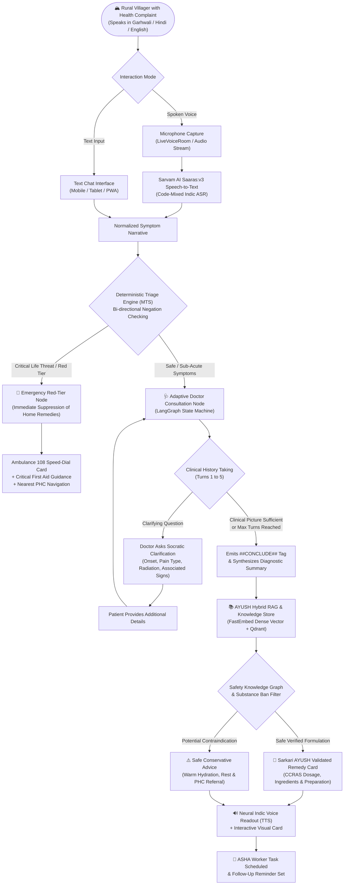
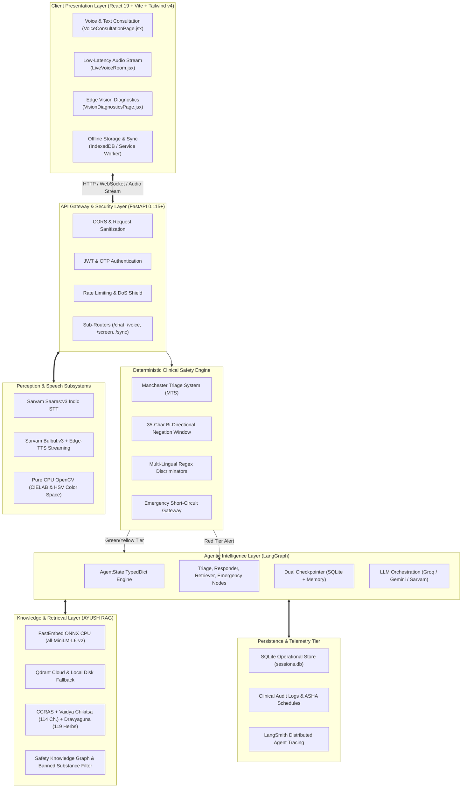
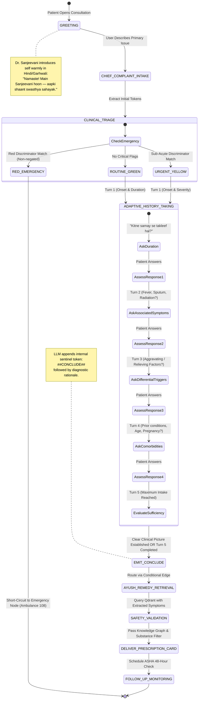
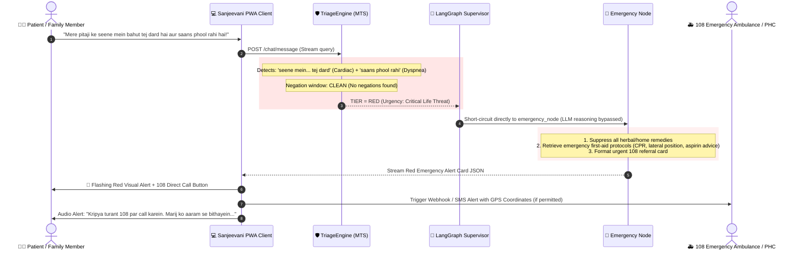
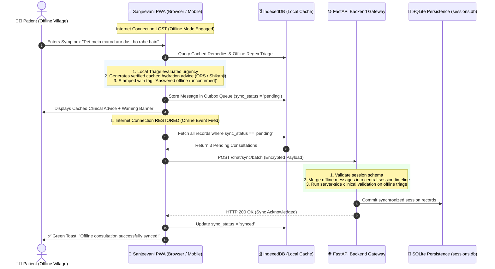
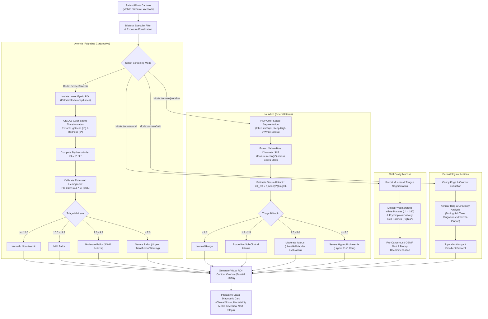
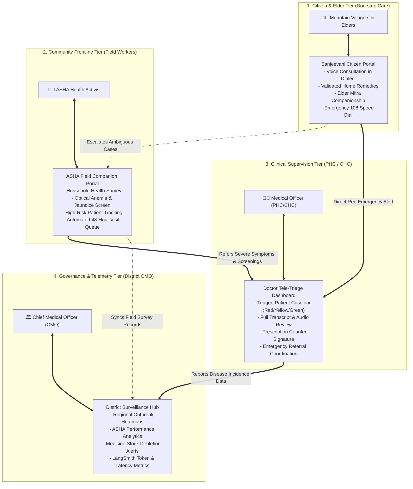

# 13. System Workflows & Mermaid Diagrams Master Guide

Welcome to the **Sanjeevani (संजीवनी) Visual Workflow Compendium**. This document provides an exhaustive, intuitive, and interpretable visual guide to every major subsystem, data pipeline, and agent workflow within Sanjeevani.

Whether you are a healthcare practitioner, clinical evaluator, software engineer, or hackathon judge, these diagrams will give you an immediate, intuitive understanding of how Sanjeevani delivers safe, culturally attuned healthcare to rural Himalayan communities.

---

## 📑 Table of Diagrams

1. [High-Level End-to-End Patient Healthcare Journey](#1-high-level-end-to-end-patient-healthcare-journey)
2. [Micro-Modular System Architecture Topology](#2-micro-modular-system-architecture-topology)
3. [Multi-Turn Adaptive Doctor Consultation State Machine](#3-multi-turn-adaptive-doctor-consultation-state-machine)
4. [Deterministic Manchester Triage & Negation Engine](#4-deterministic-manchester-triage--negation-engine)
5. [Emergency Red-Tier Short-Circuit & Rapid Response](#5-emergency-red-tier-short-circuit--rapid-response)
6. [AYUSH Hybrid RAG, Knowledge Graph & Safety Exclusion Pipeline](#6-ayush-hybrid-rag-knowledge-graph--safety-exclusion-pipeline)
7. [Offline-First Resilience & Bi-Directional Synchronization](#7-offline-first-resilience--bi-directional-synchronization)
8. [Real-Time Multilingual Voice Consultation Loop](#8-real-time-multilingual-voice-consultation-loop)
9. [Edge Non-Invasive Optical Diagnostic Suite](#9-edge-non-invasive-optical-diagnostic-suite)
10. [Multi-Stakeholder Healthcare Collaboration Ecosystem](#10-multi-stakeholder-healthcare-collaboration-ecosystem)

---

## 1. High-Level End-to-End Patient Healthcare Journey

The following diagram maps the complete experience of a rural patient—from speaking a health complaint in their native dialect to receiving personalized medical care, prescription cards, or emergency escalation.



---

## 2. Micro-Modular System Architecture Topology

Sanjeevani is architected into 7 decoupled, highly resilient micro-modules designed to operate flawlessly even under intermittent 2G/3G connectivity in mountainous regions.



---

## 3. Multi-Turn Adaptive Doctor Consultation State Machine

Unlike basic chatbots that offer instant, generic recommendations based on a single keyword, Sanjeevani conducts a true Socratic clinical intake, asking up to 5 progressive, adaptive questions before forming an assessment.



---

## 4. Deterministic Manchester Triage & Negation Engine

The following diagram illustrates how the **Deterministic Clinical Triage Engine** (`ClinicalTriageEngine`) evaluates user input before any LLM is called, protecting patients from AI hallucinations.

```mermaid
flowchart TD
    UserQuery["Incoming User Utterance\n(e.g., 'Khansi aur bukhar hai par seene me dard nahi hai')"] --> Lowercase["Normalize Text & Lowercase Conversion"]

    subgraph RegexMatching ["Regex Pattern Matching"]
        Lowercase --> MatchRed{"Match Red Pattern?\n(Cardiac, Dyspnea, Stroke, Shock)"}
        Lowercase --> MatchYellow{"Match Yellow Pattern?\n(Prolonged Fever, Severe Pain)"}
    end

    MatchRed -->|Pattern Detected at [start:end]| NegationCheckRed{"Bi-Directional Negation Check\n(35-char sliding window)"}
    MatchYellow -->|Pattern Detected at [start:end]| NegationCheckYellow{"Bi-Directional Negation Check\n(35-char sliding window)"}

    subgraph NegationWindow ["Negation Evaluation (Prefix & Postfix)"]
        NegationCheckRed -->|Preceding or Succeeding Token in:\n'nahi', 'nahin', 'no', 'not', 'denies'| DiscardRed["Negation True:\nDiscard Red Trigger"]
        NegationCheckRed -->|No Negation Token Found| ConfirmRed["Negation False:\nTrigger Active Emergency"]

        NegationCheckYellow -->|Negation Token Found| DiscardYellow["Negation True:\nDiscard Yellow Trigger"]
        NegationCheckYellow -->|No Negation Token Found| ConfirmYellow["Negation False:\nTrigger Urgent Yellow"]
    end

    MatchRed -->|No Match| MatchYellow
    DiscardRed --> MatchYellow

    ConfirmRed --> SetRedTier["Assign RED TIER (Priority 1)\n- bypass_llm = True\n- target_window = '<10 mins'"]
    ConfirmYellow --> SetYellowTier["Assign YELLOW TIER (Priority 2)\n- doctor_supervision = True\n- target_window = '<24 hours'"]
    DiscardYellow --> SetGreenTier["Assign GREEN TIER (Priority 3)\n- routine_care = True\n- home_remedy_eligible = True"]
    MatchYellow -->|No Match| SetGreenTier

    SetRedTier --> RouteDecision{"LangGraph Routing"}
    SetYellowTier --> RouteDecision
    SetGreenTier --> RouteDecision

    RouteDecision -->|RED| EmergencyHandler["Route to emergency_node"]
    RouteDecision -->|YELLOW / GREEN| ConsultationHandler["Route to responder_node (Doctor Consultation)"]
```

---

## 5. Emergency Red-Tier Short-Circuit & Rapid Response

When a life-threatening symptom (e.g., crushing chest pain, acute breathlessness, sudden loss of speech) is detected, Sanjeevani executes an instantaneous safety short-circuit.



---

## 6. AYUSH Hybrid RAG, Knowledge Graph & Safety Exclusion Pipeline

This diagram shows how traditional Ayurvedic wisdom is verified, filtered, and delivered safely without risk of toxic herb ingestion or dangerous drug-herb interactions.

```mermaid
flowchart TD
    Complaint["Consultation Concluded:\nExtracted Symptoms (e.g. Band Naak, Chhink, Khujli)"] --> RetrieverNode["Retriever Node Formulation"]

    subgraph Step1 ["1. Vector Dense Embedding & Semantic Search"]
        RetrieverNode --> FastEmbed["FastEmbed (ONNX CPU Runtime)\nModel: sentence-transformers/all-MiniLM-L6-v2\n(384-dimensional dense vectors)"]
        FastEmbed --> QdrantSearch["Qdrant Vector Database\nCollection: sanjeevani_remedies\n(Score Threshold >= 0.65)"]
        QdrantSearch -->|Match Found| RawCandidates["Top-K Candidate Formulations"]
        QdrantSearch -->|Vector Store Offline / No Match| BM25Fallback["BM25 Lexical Keyword Search\n(DATA/remedies_dataset.json)"]
        BM25Fallback --> RawCandidates
    end

    subgraph Step2 ["2. Safety Knowledge Graph Validation"]
        RawCandidates --> KGCheck{"Safety Knowledge Graph:\nCheck Comorbidities & Contraindications"}
        KGCheck -->|Contraindication Found\n(e.g., Pitta aggravation in peptic ulcer)| DiscardKG["Drop Candidate &\nRecord Safety Audit Log"]
        KGCheck -->|No Clinical Conflict| PassedKG["Approved for Substance Screen"]
    end

    subgraph Step3 ["3. Toxic Substance & Folk Term Exclusion Gate"]
        PassedKG --> SubstanceCheck{"Banned Substance Filter:\nContains Tobacco, Snuff, Opium,\nor Heavy Metals?"}
        SubstanceCheck -->|Banned Keyword Matched| QuarantineItem["Quarantine Formulation\n(Never expose to patient)"]
        SubstanceCheck -->|Pure Kitchen / Botanical Herbs| SafeBotanical["Safe Botanical Formulation"]
    end

    subgraph Step4 ["4. Government CCRAS Gold-Standard Overrides"]
        SafeBotanical --> GoldCheck{"Exact Clinical Match in\nCCRAS Gold-Standard Registry?"}
        GoldCheck -->|Yes: e.g. Allergic Rhinitis / Sinusitis| EnforceCCRAS["Enforce Official CCRAS Protocol:\n- Anu Taila Pratimarsha Nasya\n- Haridra-Tulsi Bashpa (Steam)"]
        GoldCheck -->|No: Standard Mild Ailment| EnforceCurated["Use Curated Vaidya Chikitsa Remedy"]
    end

    DiscardKG --> FallbackHydration["Default to Warm Water, Rest & Hydration Advice"]
    QuarantineItem --> FallbackHydration

    EnforceCCRAS --> Formatter["Structured Output Formatter (JSON + Markdown)"]
    EnforceCurated --> Formatter
    FallbackHydration --> Formatter

    Formatter --> FinalCard["🌿 Visual Remedy Card Rendered on Client\n(Title, Preparation Steps, Dosage, Precautions)"]
```

---

## 7. Offline-First Resilience & Bi-Directional Synchronization

Himalayan mountain villages often experience days without cellular or fiber internet. The following diagram illustrates how Sanjeevani functions completely offline and synchronizes when the network returns.



---

## 8. Real-Time Multilingual Voice Consultation Loop

Designed specifically for elderly villagers who cannot read or type, the voice loop achieves an end-to-end latency of under 1.5 seconds.

```mermaid
flowchart LR
    subgraph AudioCapture ["1. Patient Voice Input"]
        Mic["Microphone Audio Stream\n(16kHz Mono PCM)"] --> VAD["WebRTC Voice Activity Detection\n(Filters Mountain Wind Noise)"]
    end

    subgraph SpeechRec ["2. Speech-to-Text"]
        VAD --> SarvamSTT["Sarvam AI Saaras:v3\n(Garhwali, Kumaoni & Hindi Speech Recognition)"]
        SarvamSTT --> TranscribedText["Transcribed Text String"]
    end

    subgraph AgentReasoning ["3. LangGraph Clinical Reasoning"]
        TranscribedText --> LangGraphEngine["Doctor Consultation Node\n(Synthesizes Empathetic Hindi Response)"]
        LangGraphEngine --> ResponseText["Generated Response Text\n(Formatted for Speech Delivery)"]
    end

    subgraph SpeechSynthesis ["4. Text-to-Speech Streaming"]
        ResponseText --> SarvamTTS["Sarvam AI Bulbul:v3\n(Expressive Neural Indic TTS)"]
        ResponseText -.->|Fallback if Cloud Offline| EdgeTTS["Neural Edge-TTS / AI4Bharat"]
        SarvamTTS --> AudioBuffer["Audio Stream Chunks (MP3/WAV)"]
        EdgeTTS --> AudioBuffer
    end

    subgraph Playback ["5. Audio Output"]
        AudioBuffer --> AudioContext["Web Audio API Buffer Source"]
        AudioContext --> Speaker["Device Speaker Playback\n(Crystal Clear Audio)"]
    end
```



---

## 9. Edge Non-Invasive Optical Diagnostic Suite

Sanjeevani performs non-invasive optical screening entirely on standard CPU hardware using mathematical color-space transformations.



---

## 10. Multi-Stakeholder Healthcare Collaboration Ecosystem

Sanjeevani connects the entire rural healthcare delivery chain—from isolated citizens to frontline ASHAs, primary health centers, and district health authorities.



---

## Summary of Architectural Benefits

| Dimension | Legacy Medical Chatbots | Sanjeevani 2.0 Architectural Guarantee |
|---|---|---|
| **Safety in Emergencies** | Unpredictable LLM generation; risk of hallucinatory reassurance | **Deterministic MTS rules engine** overrides AI; instant 108 speed-dial injection |
| **Clinical Consultation Quality** | 1-shot answer based on keyword triggers | **5-turn adaptive Socratic intake** mimics human physician differential diagnosis |
| **Prescription Safety** | Unverified internet remedies; risks toxic folk ingestion | **CCRAS gold-standard RAG** + **Safety Knowledge Graph** + **Banned substance exclusion** |
| **Offline Mountain Reliability** | Crashes or hangs without internet connection | **PWA + IndexedDB + SQLite dual-checkpointer** with bi-directional auto-sync |
| **Elder Accessibility** | Dense English text forms; difficult navigation | **Sarvam Saaras/Bulbul voice loop** in Garhwali/Hindi (<1.5s latency) |
| **Objective Diagnostic Screening** | None; pure subjective patient text | **Edge OpenCV optical suite** for Anemia, Jaundice, Oral, and Skin screening on CPU |
| **Enterprise Governance** | Black-box opacity; no traceability | **LangSmith distributed tracing** with audit-logged clinical decision paths |
