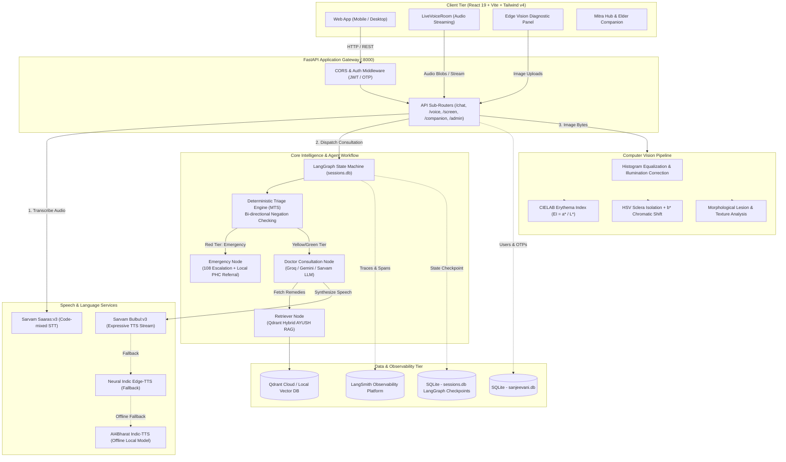
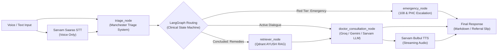
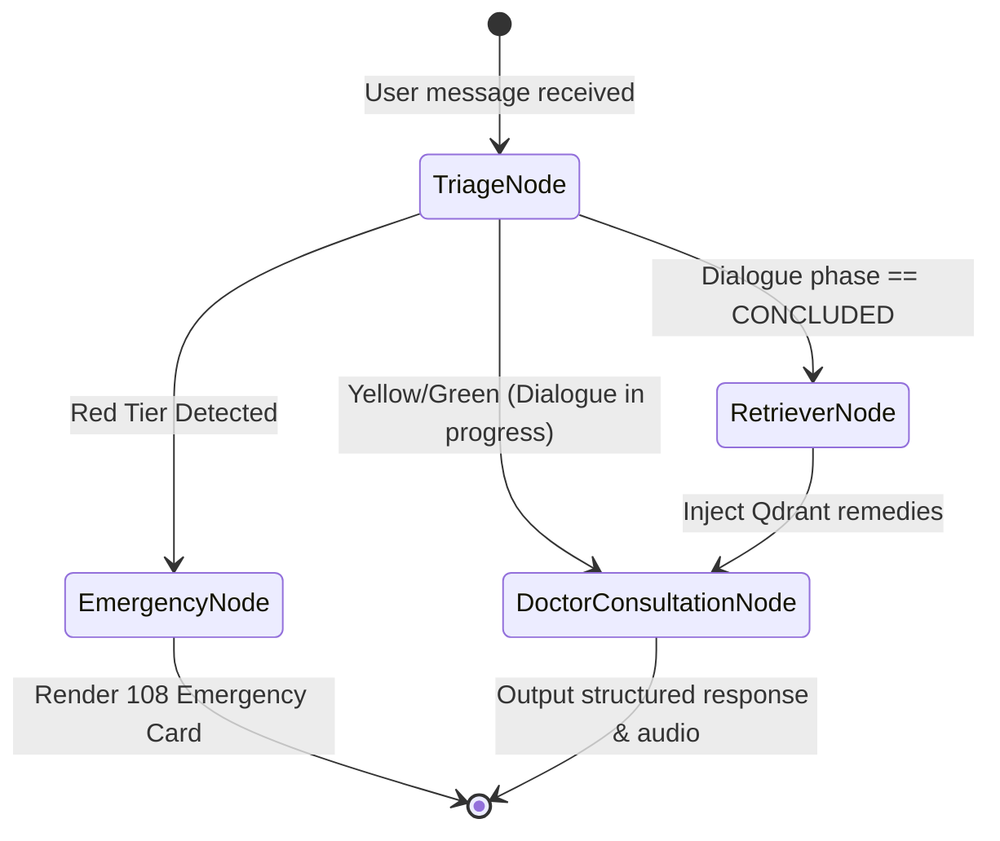
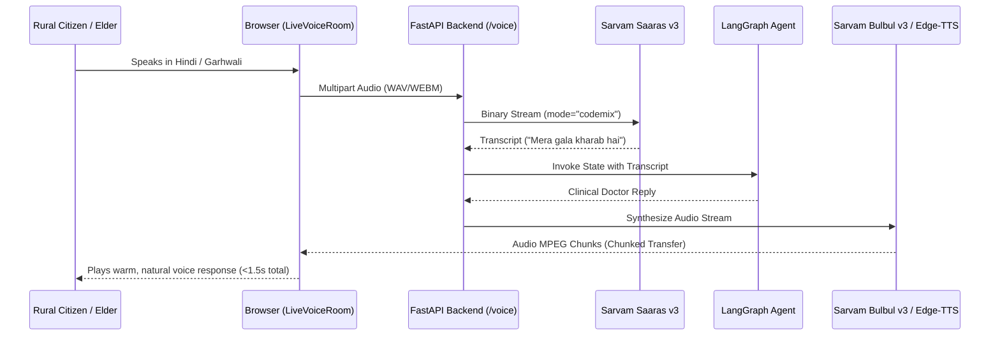

# 🌿 Sanjeevani (संजीवनी) 2.0
### Autonomous AI Health Triage, Multilingual Voice Consultation & Edge Diagnostics Platform for Rural Himalayan Communities

[](https://fastapi.tiangolo.com)
[](https://langchain-ai.github.io/langgraph/)
[](https://smith.langchain.com/)
[](https://react.dev)
[](https://vitejs.dev)
[](https://tailwindcss.com)
[](https://www.sarvam.ai/)
[](https://qdrant.tech/)
[](https://python.org)

---

## 📌 Table of Contents
1. [Executive Summary & Regional Context](#-executive-summary--regional-context)
2. [Key Architectural Highlights](#-key-architectural-highlights)
3. [System Architecture & Dataflow](#-system-architecture--dataflow)
4. [Why These Choices (Architectural Decisions)](#-why-these-choices-architectural-decisions)
5. [Complete Technology Stack](#-complete-technology-stack)
6. [Core Subsystems Deep Dive](#-core-subsystems-deep-dive)
   - [1. Deterministic Clinical Triage Engine](#1-deterministic-clinical-triage-engine)
   - [2. LangGraph Agentic Consultation Flow](#2-langgraph-agentic-consultation-flow)
   - [3. Multilingual Voice & Speech Subsystem](#3-multilingual-voice--speech-subsystem)
   - [4. AYUSH Hybrid Vector RAG](#4-ayush-hybrid-vector-rag)
   - [5. Edge Computer Vision Diagnostics](#5-edge-computer-vision-diagnostics)
   - [6. Community Health, Yoga & Elder Companionship](#6-community-health-yoga--elder-companionship)
   - [7. Role-Based Access Control & Dashboards](#7-role-based-access-control--dashboards)
   - [8. Production Tracing with LangSmith](#8-production-tracing-with-langsmith)
7. [Repository Structure & Codebase Map](#-repository-structure--codebase-map)
8. [Installation & Getting Started](#-installation--getting-started)
9. [Default Demo Credentials & Testing](#-default-demo-credentials--testing)
10. [API Route Directory](#-api-route-directory)
11. [Clinical Disclaimers & Ethical Safeguards](#-clinical-disclaimers--ethical-safeguards)

---

## 🏔️ Executive Summary & Regional Context

Rural mountainous terrains such as **Chamoli, Pauri, and Tehri Garhwal in Uttarakhand** face acute healthcare delivery challenges:
- **Geographical Isolation**: Villages are often miles from primary health centers (PHCs), accessible only via steep mountain footpaths.
- **Linguistic Barriers**: Mountain elders primarily communicate in Garhwali or regional Hindi dialects, struggling with standard English or formal Hindi medical software.
- **Overburdened Frontline Workers**: Accredited Social Health Activists (ASHAs) lack instantaneous clinical decision support tools when assessing ambiguous or worsening symptoms.
- **Delayed Intervention**: Subtle clinical deteriorations (e.g., severe dehydration, progressing anemia, jaundice, atypical chest pain) are identified late, escalating preventable morbidity.

**Sanjeevani (संजीवनी)** bridges this gap as a **safety-first, offline-tolerant, multilingual AI clinical triage, voice assistant, and diagnostic platform**. Built with deterministic medical guardrails, classical AYUSH formulation retrieval, computer vision screening, and rural elderly companionship, Sanjeevani empowers citizens, ASHAs, and administrators with immediate, culturally attuned medical guidance.

---

## ⚡ Key Architectural Highlights

- **Deterministic Safety Guarantee**: LLMs are **strictly forbidden** from independently triaging emergencies. Urgency is classified by an algorithmic rules engine based on the **Manchester Triage System (MTS)** with bi-directional negation awareness before any generative model is called.
- **Ultra-Low Latency Conversational Voice (Sanjeevani Live)**: Powered by **Sarvam AI (Saaras v3 STT + Bulbul v3 TTS)** and streaming neural Indic voice pipelines, conversational turns complete in <1.5 seconds, optimized for elderly villagers.
- **Stateful Clinical Graph**: Uses **LangGraph** with SQLite session persistence (`SqliteSaver`) to execute structured, multi-turn clinical interviews (Greeting $\rightarrow$ Symptom Intake $\rightarrow$ Differential Clarification $\rightarrow$ Remedy Delivery $\rightarrow$ Concluded).
- **Dual-Stream AYUSH Knowledge RAG**: FastEmbed embeddings (`sentence-transformers/all-MiniLM-L6-v2`) combined with **Qdrant Vector Database** to index validated CCRAS formulas and extracted classical Ayurvedic texts alongside a Garhwali dialect lexicon.
- **Edge Non-Invasive Vision Screening**: Pure OpenCV computer vision algorithms running on CPU to detect **Conjunctival Pallor (Anemia)** via CIELAB Erythema Index, **Scleral Icterus (Jaundice)** via chromatic shift, **Oral Hyperkeratosis/Leukoplakia**, and **Cutaneous Lesions**.
- **Observability by Design**: Full integration with **LangSmith** for distributed tracing of agent states, tool executions, token metrics, and latency analysis.

---

## 🏗️ System Architecture & Dataflow



### 🔄 End-to-End Clinical Consultation Dataflow

The sequence below illustrates the runtime flow for both text and voice interactions:



---

## 💡 Why These Choices (Architectural Decisions)

| Component Choice | Alternative Considered | Why We Chose It for Sanjeevani |
|---|---|---|
| **LangGraph** | Linear Chains / Single-Prompt Agents (LCEL) | **Stateful multi-turn clinical interview, explicit branching & reliable persistence**: Standard linear chains cannot safely handle clinical dialogue where symptoms evolve across turns. LangGraph enables deterministic conditional edges (e.g., immediate bypass to emergency if red-tier symptoms appear on turn 4), structured cycle loops for differential clarification, and durable checkpointing (`SqliteSaver` / Postgres checkpointer) so intermittent village connectivity never drops patient conversation context. |
| **Qdrant** | PostgreSQL `pgvector` / ChromaDB | **Zero-ops embedded mode for development, seamless cloud scaling for production, & high-speed hybrid search**: At this stage of development and field trials, Qdrant allows local file-based embedded mode (`qdrant_client.QdrantClient(path="./qdrant_data")`) with zero database daemon overhead. For production scale, it switches via a single environment variable to managed Qdrant Cloud. Furthermore, Qdrant provides sub-millisecond dense cosine filtering optimized for bilingual AYUSH formulary metadata. |
| **Sarvam AI** | Bhashini / Indic-Trans / OpenAI Whisper | **Ultra-low latency, streaming chunked TTS, and native Garhwali/Hindi phoneme handling**: Bhashini APIs often suffer from erratic response latencies (>4–8s) and lack streaming audio primitives essential for low-bandwidth village connections. Sarvam AI's Saaras:v3 STT and Bulbul:v3 TTS deliver sub-second (<1.2s) round-trips with code-mixed Hindi/Garhwali dialect comprehension and natural expressive village tones (*"Dada-ji"*, *"Behen-ji"*), preventing elder cognitive fatigue. |

---

## 💻 Complete Technology Stack

| Layer | Technology | Purpose & Implementation Details |
|---|---|---|
| **Frontend Framework** | **React 19.2.8** | Modern reactive UI, hook-based state management, optimized rendering |
| **Build & Bundler** | **Vite 8.3.0** | Ultra-fast HMR and ESM production bundling |
| **Styling & Design** | **Tailwind CSS v4.3.3** | Custom design system using Himalayan color palette (`warm-indigo`, `mist`, `pine-green`) |
| **Icons & Animation** | **Lucide-React & Framer Motion** | Micro-animations, responsive transitions, accessible visual iconography |
| **Backend Gateway** | **FastAPI 2.0.0** | Asynchronous RESTful API framework with automatic OpenAPI documentation |
| **Agentic Framework** | **LangGraph** | Cyclic clinical graph workflows with state checkpointing (`SqliteSaver`) |
| **Observability** | **LangSmith** | Distributed session tracing, span monitoring, token consumption metrics |
| **LLM Reasoning** | **Groq (Llama-3.1 70B/8B)** | Sub-second generative inference for clinical conversational nodes |
| **LLM Fallbacks** | **Google Gemini 1.5 Flash & Sarvam-105b** | Multi-lingual fallback and high-accuracy Indic reasoning |
| **Vector Database** | **Qdrant (Cloud & On-Disk)** | Dense vector similarity search for AYUSH remedies and Garhwali dialect glossary |
| **Embeddings** | **FastEmbed (`all-MiniLM-L6-v2`)** | 384-dimensional dense semantic representations cached locally |
| **Speech-to-Text (STT)** | **Sarvam AI (Saaras:v3)** | Real-time Indian code-mixed and Garhwali audio speech transcription |
| **Text-to-Speech (TTS)** | **Sarvam AI (Bulbul:v3) + Edge-TTS** | Low-latency audio streaming in natural Hindi and Garhwali accents |
| **Offline TTS Engine** | **AI4Bharat Indic-TTS / Parler-TTS** | Local neural acoustic model fallback for zero-connectivity setups |
| **Computer Vision** | **OpenCV (`opencv-python-headless`)** | Color space conversion (RGB $\rightarrow$ CIELAB, HSV), contour mapping, and ROI masking |
| **Relational Storage** | **SQLite3 (WAL Mode)** | Local transactional storage for user accounts, OTP authentication, and audit logs |

---

## 🔍 Core Subsystems Deep Dive

### 1. Deterministic Clinical Triage Engine
Located in [`backend/app/core/triage_engine.py`](file:///d:/Sanjeevani/backend/app/core/triage_engine.py).

The triage engine operates on the clinical principles of the **Manchester Triage System (MTS)**. It classifies user complaints into three deterministic tiers:
1. **Red Tier (Emergency / Life-Threatening)**:
   - Cardiac chest pain, radiating arm pain, acute respiratory distress, severe hemoptysis, altered mental status/syncope, anaphylactic signs, infant high fever.
   - **Action**: Immediately short-circuits the agent graph to `emergency_node`. Suppresses all home remedies. Triggers **108 emergency escalation protocol** and outputs local PHC emergency guidelines.
2. **Yellow Tier (Urgent / Sub-Acute)**:
   - High fever persisting $>3$ days, localized severe abdominal pain, persistent vomiting, dehydration signs.
   - **Action**: Generates clinical precautions, prompts the patient to visit an ASHA worker or CHC within 24 hours, and enables supervised symptomatic relief.
3. **Green Tier (Non-Urgent / Self-Care)**:
   - Mild common cold, superficial abrasions, routine digestive discomfort, seasonal allergies.
   - **Action**: Directs to doctor consultation dialogue, retrieves safe, non-toxic AYUSH formulations from CCRAS database, and provides lifestyle guidance.

#### Bi-Directional Negation Detection
Clinical text often contains statements such as *"I have a cough but **no chest pain**"* or *"khasi hai par **seene me dard nahi hai**"*.
The engine evaluates a **35-character sliding window** both preceding (English style: *"no"*, *"denies"*) and succeeding (Hindi style: *"nahi"*, *"koi nahi"*) any matched clinical pattern. If a negation cue is detected within the window, the discriminator is safely disregarded.

---

### 2. LangGraph Agentic Consultation Flow
Located in [`backend/app/agents/graph.py`](file:///d:/Sanjeevani/backend/app/agents/graph.py).

The consultation lifecycle is modeled as a state machine using `AgentState`:



- **`triage_node`**: Normalizes Garhwali dialect tokens, runs MTS evaluation, flags clinical tags, and updates state.
- **`doctor_consultation_node`**: Orchestrated by Groq Llama-3.1 with clinical prompting.
  - In **Voice Mode (Sanjeevani Live)**: Constrained to **one concise question at a time** (maximum 2 sentences) so rural elders can comfortably listen and respond.
  - In **Chat Mode**: Formats markdown with structured sections: Assessment, Safety Guidance, and Suggested Next Steps.
  - Automatically emits `##CONCLUDE##` when symptom exploration is complete, triggering remedy retrieval.
- **`retriever_node`**: Queries Qdrant for CCRAS-validated formulations matching the extracted chief complaint.
- **`emergency_node`**: Deterministic bypass that alerts 108 ambulance services, provides tele-triage instructions, and displays nearest healthcare facilities.

---

### 3. Multilingual Voice & Speech Subsystem
Located in [`backend/app/api/voice.py`](file:///d:/Sanjeevani/backend/app/api/voice.py), [`sarvam_stt.py`](file:///d:/Sanjeevani/backend/app/core/sarvam_stt.py), and [`tts_engine.py`](file:///d:/Sanjeevani/backend/app/core/tts_engine.py).



- **Voice Mode Detection**: When activated via the interactive **Sanjeevani Orb**, responses are automatically optimized for audio delivery (markdown symbols, bullet points, and citations are stripped before synthesis).
- **Streaming Audio**: The `/voice/tts/stream` endpoint delivers chunked MP3 audio directly to native HTML5 `<audio>` elements for progressive playback without waiting for complete generation.
- **Tri-Layer Fallback Architecture**:
  1. **Primary**: Sarvam AI (High-fidelity Indian accents, Garhwali & Hindi phoneme support).
  2. **Secondary**: Neural Indic Edge-TTS (Zero-cost cloud streaming).
  3. **Tertiary**: AI4Bharat Indic-TTS (Fully offline PyTorch neural synthesis).

---

### 4. AYUSH Hybrid Vector RAG
Located in [`backend/app/core/hybrid_rag.py`](file:///d:/Sanjeevani/backend/app/core/hybrid_rag.py).

Sanjeevani indexes and cross-references two authoritative knowledge bases:
1. **CCRAS (Central Council for Research in Ayurvedic Sciences)**: Standardized Ayurvedic home remedies for common ailments (fever, cough, digestive disorders, joint aches).
2. **Classical Ayurvedic Treatises**: Extracted formulations from classical literature (`DATA/Ayush/ayurveda_1.docx`) via [`ayush_docx_extractor.py`](file:///d:/Sanjeevani/backend/app/core/ayush_docx_extractor.py).
3. **Garhwali Dialect Translation Lexicon**: Maps colloquial Garhwali terms (e.g., *mund dard* $\rightarrow$ headache, *pet chhutna* $\rightarrow$ diarrhea, *gala baithna* $\rightarrow$ hoarseness) into standard clinical terms.

All vectors are embedded via **FastEmbed (`all-MiniLM-L6-v2`)** and stored in **Qdrant** with Cosine Similarity scoring. When the patient's symptoms are categorized, relevant non-toxic remedies are retrieved with dosage disclaimers:
> *"यह सुझाव केवल प्राथमिक स्वास्थ्य मार्गदर्शन के लिए है। किसी भी दवा का सेवन करने से पहले नजदीकी चिकित्सक या आशा कार्यकर्ता से परामर्श लें।"*

---

### 5. Edge Computer Vision Diagnostics
Located in [`backend/app/cv/screening.py`](file:///d:/Sanjeevani/backend/app/cv/screening.py).

Designed to operate entirely on **client hardware or edge CPU nodes** without sending patient images to external cloud APIs:

```
┌─────────────────────────────────────────────────────────────────────────┐
│                    EDGE COMPUTER VISION SCREENING PIPELINE              │
└─────────────────────────────────────────────────────────────────────────┘
  [Input Image] ────────► [Bilateral Filter & Illumination Normalization]
                                      │
       ┌──────────────────────────────┼─────────────────────────────┐
       ▼                              ▼                             ▼
 [Palpebral Conjunctiva]      [Sclera Region]             [Oral Cavity / Skin]
       │                              │                             │
 [RGB ➔ CIELAB Space]         [RGB ➔ HSV Space]           [Texture & Morph Mask]
       │                              │                             │
 Calculate Erythema Index     Isolate Yellow Chroma       Detect Leukoplakia &
 (EI = a* / L*)               Shift in b* channel         Erythematous Lesions
       │                              │                             │
       ▼                              ▼                             ▼
 Hemoglobin Estimation (g/dL) Bilirubin Estimation        Pathology Risk Overlay
 & Pallor Classification      & Icterus Severity          & Clinical Referral
```

- **Anemia Screening (`/screen/anemia`)**: Analyzes the palpebral conjunctiva. Converts region to CIELAB space and evaluates the Erythema Index:
  $$\text{EI} = \frac{a^*}{L^*}$$
  Estimates Hemoglobin ($Hb$) levels and classifies risk into *Normal*, *Mild*, *Moderate*, or *Severe Pallor*.
- **Jaundice Screening (`/screen/jaundice`)**: Evaluates scleral icterus by filtering the eye white in HSV space, quantifying chromatic shift in the yellow-blue CIELAB $b^*$ axis, and estimating Serum Bilirubin.
- **Oral Cavity Screening (`/screen/oral`)**: Evaluates mucosal hyperkeratosis (Leukoplakia white patches and Erythroplakia) vital for rural regions with high consumption of smokeless tobacco.
- **Skin Lesion Screening (`/screen/skin`)**: Evaluates cutaneous erythema, tinea fungal rings, and eczema patterns.

---

### 6. Community Health, Yoga & Elder Companionship

Sanjeevani provides holistic wellness services to combat physical and emotional isolation:

1. **Sanjeevani Saathi (संजीवनी साथी - Village Companion)**:
   - Located in [`backend/app/api/companion.py`](file:///d:/Sanjeevani/backend/app/api/companion.py).
   - Designed for lonely rural elders whose family members have migrated to urban centers.
   - Converses in gentle, respectful village dialect (*"Dada-ji"*, *"Dadi-ji"*), plays soothing Himalayan folk stories (*Pahadi Kisse*), offers daily affirmations, and includes built-in crisis detection linked to **Tele-MANAS (14416)**.
2. **Yogashala (योगशाला - Yoga Teacher & Posture Guide)**:
   - Interactive yoga posture guidance with breathing timers and step-by-step instructions for rural arthritis, back pain, and hypertension.
3. **Dhyan Guru (ध्यान गुरु - Meditation Teacher)**:
   - Guided Pranayama (Anulom Vilom, Bhramari) with audio-visual breathing pacing.

---

### 7. Role-Based Access Control & Dashboards

The application implements three dedicated user portals:
- **Citizen / Patient Hub (`/mitra` & `/patient`)**:
  - Live voice consultation, symptom history, downloaded clinical referral slips, nearby PHC finder, and screening suite.
- **ASHA Field Worker Dashboard (`/asha`)**:
  - High-priority patient escalation queue, community triage breakdown (Red / Yellow / Green distribution), patient follow-up checklist, and automated SMS/Email dispatch.
- **District Health Administrator Portal (`/admin`)**:
  - System performance diagnostics, active LLM provider toggles (Groq / Gemini / Sarvam), database audit logs, and village-wise epidemiological charts.

---

### 8. Production Tracing with LangSmith

Every consultation run, agent transition, and LLM call is automatically streamed to **LangSmith**:
- **Project Name**: `sanjeevani`
- **Execution Run Name**: `Sanjeevani Consultation (<session_id>)`
- **Tracked Spans**:
  - `triage_node` $\rightarrow$ Regex discriminator matching and latency.
  - `route_clinical_flow` $\rightarrow$ Deterministic graph decision.
  - `retriever_node` $\rightarrow$ Qdrant similarity scores and payload retrieval.
  - `doctor_consultation_node` $\rightarrow$ Full prompt context, token usage, and completion text.
  - `ChatGroq` / `ChatGoogleGenerativeAI` / `ChatOpenAI` $\rightarrow$ Model-level latency and TTFT (Time To First Token).

---

## 📁 Repository Structure & Codebase Map

```
Sanjeevani/
├── README.md                      # Primary project documentation (this file)
├── backend/                       # FastAPI & LangGraph backend service
│   ├── README.md                  # Backend architecture & developer guide
│   ├── .env                       # Environment configuration & API credentials
│   ├── pyproject.toml             # Python build configuration
│   ├── requirements.txt           # Python dependency specification
│   ├── sanjeevani.db              # SQLite relational database (Users & OTPs)
│   ├── sessions.db                # SQLite LangGraph checkpointer storage
│   ├── DATA/                      # Datasets & Knowledge assets
│   │   ├── remedies_dataset.json  # CCRAS Ayurvedic remedy corpus
│   │   ├── Ayush/                 # Ayurvedic treatise documents (.docx)
│   │   └── Garhwali/              # Garhwali regional glossary & phrases
│   ├── app/
│   │   ├── main.py                # FastAPI app creation & lifespan setup
│   │   ├── config.py              # Pydantic Settings & environment loader
│   │   ├── models.py              # SQLite models, DB connection & default seed
│   │   ├── agents/                # LangGraph clinical workflow
│   │   │   ├── graph.py           # StateGraph definition & conditional edges
│   │   │   ├── state.py           # AgentState definition (TypedDict)
│   │   │   └── nodes/             # Execution nodes (triage, responder, etc.)
│   │   ├── api/                   # FastAPI route controllers
│   │   │   ├── chat.py            # /chat/message & session endpoints
│   │   │   ├── voice.py           # /voice/tts, /voice/stt & audio streaming
│   │   │   ├── screen.py          # /screen/anemia, /screen/jaundice, etc.
│   │   │   ├── companion.py       # /companion/chat, stories, daily thought
│   │   │   ├── auth_api.py        # Authentication, JWT, and OTP routes
│   │   │   ├── admin_api.py       # Admin analytics & health metrics
│   │   │   └── reports.py         # PDF clinical referral slip generator
│   │   ├── core/                  # Engine implementations
│   │   │   ├── triage_engine.py   # Manchester Triage System & negation logic
│   │   │   ├── hybrid_rag.py      # Qdrant Vector Store & FastEmbed embeddings
│   │   │   ├── sarvam_stt.py      # Sarvam Saaras v3 client
│   │   │   ├── tts_engine.py      # Indic TTS & Sarvam Bulbul engine
│   │   │   ├── bhashini_engine.py # Markdown stripping & text normalizer
│   │   │   └── notification_service.py # Gmail SMTP & Twilio/Fast2SMS dispatch
│   │   └── cv/                    # Edge Computer Vision modules
│   │       ├── screening.py       # Erythema Index & Icterus CV algorithms
│   │       └── preprocessor.py    # CLAHE & illumination correction
│   └── tests/                     # Pytest suite (triage, auth, RAG, voice, CV)
└── frontend/                      # React 19 + Vite frontend application
    ├── README.md                  # Frontend UX & component guide
    ├── package.json               # Node.js dependencies & scripts
    ├── vite.config.js             # Vite bundler configuration
    ├── index.html                 # Single page app entry HTML
    └── src/
        ├── App.jsx                # Router & role-based route guard
        ├── main.jsx               # React DOM initialization
        ├── api/                   # Axios HTTP & Voice API clients
        ├── components/            # Reusable UI widgets
        │   ├── LiveVoiceRoom.jsx  # Interactive voice chat room
        │   ├── SanjeevaniOrb.jsx  # Visualizer orb with mic states
        │   ├── StructuredBotMessage.jsx # Rich Markdown & remedy card renderer
        │   ├── EscalationCard.jsx # Red-tier emergency card
        │   └── NearbyFacilityFinder.jsx # GPS PHC locator
        ├── context/               # AuthContext & ThemeContext
        └── pages/                 # Full view pages
            ├── Home.jsx           # Landing page
            ├── Chat.jsx           # Dr. Sanjeevani clinical consultation
            ├── Screening.jsx      # Eye & Skin vision diagnostic suite
            ├── Companion.jsx      # Sanjeevani Saathi elder companion
            ├── YogaTeacher.jsx    # Yogashala posture guide
            ├── MeditationTeacher.jsx # Dhyan Guru breathing guide
            ├── AshaDashboard.jsx  # ASHA worker triage queue
            └── AdminDashboard.jsx # Administrator controls
```

---

## 🚀 Installation & Getting Started

### Prerequisites
- **Python**: `>= 3.11` (managed via [`uv`](https://docs.astral.sh/uv/) or standard `python -m venv`)
- **Node.js**: `>= 20.x` & **npm**: `>= 10.x`
- **Operating System**: Windows, Linux, or macOS

---

### Step 1: Clone the Repository
```bash
git clone https://github.com/Sachinsingh198/Sanjeevani.git
cd Sanjeevani
```

---

### Step 2: Backend Configuration & Setup

1. **Navigate to the backend directory**:
   ```bash
   cd backend
   ```

2. **Configure Environment Variables**:
   Create or verify `backend/.env`:
   ```ini
   APP_ENV=development
   DEFAULT_LANGUAGE=hi

   # Primary LLM Selection ("groq", "gemini", or "sarvam")
   PRIMARY_LLM_PROVIDER=groq
   GROQ_API_KEY=your_groq_api_key
   GROQ_MODEL=llama-3.1-8b-instant

   # Google Gemini Fallback
   GEMINI_API_KEY=your_gemini_api_key
   GEMINI_MODEL=gemini-1.5-flash

   # Sarvam AI (Indic STT, TTS & Indic LLM)
   SARVAM_API_KEY=your_sarvam_api_key
   TTS_PROVIDER=sarvam

   # LangSmith Tracing & Observability
   LANGCHAIN_TRACING_V2=true
   LANGCHAIN_ENDPOINT=https://api.smith.langchain.com
   LANGCHAIN_API_KEY=your_langsmith_api_key
   LANGCHAIN_PROJECT=sanjeevani

   # Qdrant Vector Store (Leave URL blank for local on-disk mode)
   QDRANT_PATH=./qdrant_data
   QDRANT_COLLECTION_NAME=sanjeevani_remedies
   QDRANT_URL=
   QDRANT_API_KEY=

   # Database Paths
   DATABASE_URL=sqlite:///./sanjeevani.db
   CHECKPOINT_DB_PATH=sqlite:///./sessions.db
   ```

3. **Install Dependencies & Start the Backend**:
   Using `uv` (recommended):
   ```bash
   uv sync
   uv run uvicorn app.main:app --reload --host 0.0.0.0 --port 8000
   ```
   *Or using standard pip*:
   ```bash
   python -m venv .venv
   source .venv/bin/activate  # On Windows: .venv\Scripts\activate
   pip install -r requirements.txt
   uvicorn app.main:app --reload --host 0.0.0.0 --port 8000
   ```

4. **Verify Backend Health**:
   Visit [http://localhost:8000/health](http://localhost:8000/health) or explore the Swagger docs at [http://localhost:8000/docs](http://localhost:8000/docs).

---

### Step 3: Frontend Setup

1. **Open a new terminal and navigate to `frontend`**:
   ```bash
   cd frontend
   ```

2. **Install Node dependencies**:
   ```bash
   npm install
   ```

3. **Start the Vite Development Server**:
   ```bash
   npm run dev
   ```

4. **Open in Browser**:
   Navigate to [http://localhost:5173](http://localhost:5173).

---

## 🔑 Default Demo Credentials & Testing

The application automatically seeds three role accounts upon database initialization:

| Role | Username / Identifier | Password | Access Rights & Purpose |
|---|---|---|---|
| **Citizen (Patient)** | `patient` or `sachin.patient@gmail.com` | `sanjeevani2026` | Clinical consultation, vision screening, Yoga, Meditation, Saathi companion |
| **ASHA Worker** | `asha` or `sunita.asha@sanjeevani.gov.in` | `sanjeevani2026` | Community patient triage queue, red-tier escalation cards, referral slips |
| **District Admin** | `admin` or `admin@sanjeevani.gov.in` | `sanjeevani2026` | System health, telemetry, LLM provider switching, user administration |

---

## 📡 API Route Directory

| Group | Method | Endpoint | Description |
|---|---|---|---|
| **System** | `GET` | `/health` | Application status, active LLM provider, and vector DB info |
| **Auth** | `POST` | `/auth/register` | Register citizen or frontline worker |
| **Auth** | `POST` | `/auth/login` | Authenticate via username, phone, or email |
| **Auth** | `POST` | `/auth/otp/send` | Dispatch OTP to email or mobile SMS |
| **Auth** | `POST` | `/auth/otp/verify` | Verify OTP code |
| **Consultation** | `POST` | `/chat/message` | Submit message to LangGraph clinical state machine |
| **Consultation** | `GET` | `/chat/history/{id}` | Retrieve past consultation turns |
| **Voice** | `POST` | `/voice/stt` | Transcribe spoken audio using Sarvam Saaras v3 |
| **Voice** | `POST` | `/voice/tts` | Synthesize natural Indic audio |
| **Voice** | `POST` | `/voice/tts/stream`| Stream synthesized audio chunks (progressive playback) |
| **Vision Diagnostics** | `POST` | `/screen/anemia` | CIELAB Erythema Index evaluation on conjunctiva |
| **Vision Diagnostics** | `POST` | `/screen/jaundice` | Scleral icterus chromatic shift evaluation |
| **Vision Diagnostics** | `POST` | `/screen/oral` | Oral cavity leukoplakia and mucosal screening |
| **Vision Diagnostics** | `POST` | `/screen/skin` | Dermatological lesion and fungal pattern analysis |
| **Elder Companion** | `POST` | `/companion/chat` | Empathetic conversation with village elder companion |
| **Elder Companion** | `GET` | `/companion/stories` | Comforting Himalayan folk tales (*Pahadi Kisse*) |
| **Admin** | `GET` | `/admin/metrics` | System latency, active sessions, and triage distribution |

---

## 🧪 Automated Testing Suite

Execute comprehensive unit and integration tests from the `backend/` directory:

```bash
# Run all tests
uv run pytest -v

# Run deterministic triage safety tests
uv run pytest tests/test_clinical_triage.py -v

# Run LangGraph agent workflow tests
uv run pytest tests/test_agent_workflow.py -v

# Run Computer Vision screening pipeline tests
uv run pytest tests/test_cv_pipeline.py -v

# Run Sarvam AI voice integration tests
uv run pytest tests/test_sarvam_integrations.py -v
```

---

## ⚖️ Clinical Disclaimers & Ethical Safeguards

1. **Not a Physician Replacement**: Sanjeevani is an **AI-assisted preliminary health triage and information tool**. It does not establish a physician-patient relationship and does not replace in-person physical evaluation by a licensed medical practitioner.
2. **Deterministic Emergency Bypass**: In case of chest pain, severe shortness of breath, heavy bleeding, or altered consciousness, Sanjeevani immediately displays emergency contacts (**108 Ambulance**, **104 Health Helpline**) and disallows self-care suggestions.
3. **Data Privacy & Offline First**: Diagnostic screening calculations are executed on the edge or project backend without transferring raw biometric photographs to external third-party servers.
4. **Cultural Attribution**: Classical formulations and herbal remedies are cited from validated CCRAS databases and traditional Ayurvedic treatises to promote safe, non-toxic wellness in remote Himalayan regions.

---

### 👥 Project Credits & Affiliation
Developed for the rural communities of Uttarakhand by:
- **Institute of Technology, Gopeshwar (Chamoli)**
- **Veer Madho Singh Bhandari Uttarakhand Technical University (VMSB UTU)**
- *Dedicated to the brave ASHA workers and community caregivers serving across the Himalayas.* 🏔️
